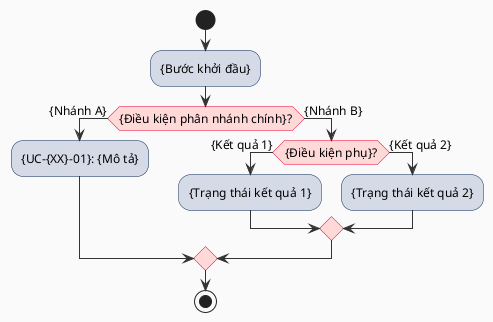
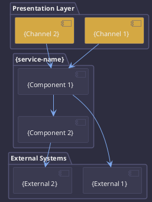
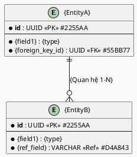
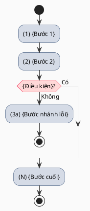

# Flow {XX} — {Tên chức năng}

> **Template:** SRS Feature-Level v4 | **Cấu trúc:** SRS_Template standard (12 sections: 0–11)
> **Thay đổi so với v3:**
> - [v4.1] Cấu trúc 12 sections (0–11): 0 Preamble, 1 Introduction, 2 Business Context, 3 System Overview, 4 Data Model, 5 Functional Requirements, 6 State & Behavioral Models, 7 Business Rules & Validation, 8 NFR, 9 Constraints, 10 RTM, 11 Appendix
> - [v4.2] Section 3 System Overview tách riêng — High-Level Activity Diagram + Architecture (dời từ cuối tài liệu lên)
> - [v4.3] Section 4 Data Model gộp Entity tables + ER diagram + Kafka Events + API Endpoints
> - [v4.4] Section 7 Business Rules & Validation gộp BR table + Validation Rules + Error Codes (section 4 cũ)
> - [v4.5] Section 11 Appendix chứa Figma Mapping tables + Screen List + Chức năng ảnh hưởng + Gap Analysis
> - [v4.6] Section 10 RTM bổ sung cột BR + AC + Test Case (từ RTM chuẩn)
> - [v4.7] Figma Mapping tables dời về Appendix 11.1, UC detail chỉ giữ inline blockquote tham chiếu

**Dự án:** {Tên dự án}
**Trang Confluence gốc:** `{confluence-url}`
**Người soạn:** BA Team
**Ngày:** {YYYY-MM-DD}

---

## 0. Preamble

### Thông tin tài liệu

| | |
|---|---|
| **Tên tài liệu** | SRS Feature-Level — {FR-XX}: {Tên chức năng} |
| **Phiên bản** | {X.Y} |
| **Ngày** | {YYYY-MM-DD} |
| **Tác giả** | BA Team |
| **Trạng thái** | Draft / In Review / Approved |

### Bảng ghi nhận thay đổi

A – Tạo mới, M – Sửa đổi, D – Xóa bỏ

| Ngày | Vị trí | A/M/D | Nguồn gốc | Link CR | Mô tả thay đổi | Phiên bản Confluence | Phiên bản mới |
|---|---|---|---|---|---|---|---|
| {YYYY-MM-DD} | Toàn bộ | A | {PRD vX / Architecture vX / ...} | — | Tạo mới — SRS Feature-Level cho {FR-XX}: {Tên chức năng}. Bao gồm {N} chức năng con ({FR-XX-01} → {FR-XX-0N}) của {service-name}. | — | 1.0 |

### Bảng phê duyệt

| Vai trò | Họ tên | Chữ ký | Ngày |
|---|---|---|---|
| BA Lead | | | |
| Product Owner | | | |
| Tech Lead | | | |
| UX Designer | | | |

---

## 1. Introduction

### 1.1 Purpose

{Mô tả mục đích tài liệu — đặc tả yêu cầu phần mềm chi tiết cho {FR-XX}: {Tên chức năng} thuộc {Tên dự án}. Phạm vi bao gồm {N} chức năng con ({FR-XX-01} → {FR-XX-0N}) của **{service-name}**.}

| | |
|---|---|
| **Vấn đề cần giải quyết** | {Mô tả vấn đề nghiệp vụ mà flow này giải quyết.} |
| **Business Goals & Metrics** | {Metric ID}: {Chỉ số mục tiêu}. Nguồn: {PRD Metrics MX}. |
| **Loại chức năng** | ☐ Mobile app &nbsp;&nbsp; ☐ Web app &nbsp;&nbsp; ☐ Tiến trình &nbsp;&nbsp; ☐ API |
| **Đường dẫn chức năng** | {Đường dẫn menu/navigation dẫn đến chức năng.} |
| **Precondition** | {UC-XX-01}: {Điều kiện tiên quyết}. {UC-XX-02}: {Điều kiện tiên quyết}. |
| **Post-condition** | {Trạng thái hệ thống sau khi UC hoàn thành thành công. Bao gồm: DB state, events published, session state.} |
| **Flow liên quan** | Flow {YY} ({Tên}) → **Flow {XX} (này)** → Flow {ZZ} ({Tên}) |

### 1.2 Scope

**Phạm vi (In-scope):**

| Sub-FR | Chức năng | Phân kỳ |
|--------|-----------|---------|
| FR-{XX}-01 | {Tên chức năng} | MVP Bắt buộc / MVP Nên có / Phase 2 |
| FR-{XX}-02 | {Tên chức năng} | MVP Bắt buộc |

**Ngoài phạm vi (Out-of-scope):**
- {Tính năng A} — {Lý do / Phase kế hoạch}
- {Tính năng B} — {Lý do}

### 1.3 Definitions & Acronyms

| Thuật ngữ / Viết tắt | Giải thích |
|---|---|
| NTBH | Nền tảng Bảo hiểm 2.0 — Insurance Middleware Platform |
| {Thuật ngữ domain} | {Giải thích} |
| {Trạng thái / State} | {Mô tả trạng thái, quyền hạn tương ứng}. **Ghi chú lịch sử (nếu có):** {Lý do đặt tên / đổi tên}. |
| JWT | JSON Web Token — Token xác thực phiên |
| OTP | One-Time Password — Mã xác thực dùng một lần |
| TTL | Time To Live — Thời gian hiệu lực |
| PDPA | Personal Data Protection Act — Luật bảo vệ dữ liệu cá nhân |

> **Hướng dẫn:** Mỗi trạng thái entity (nếu flow có state machine) phải có entry riêng, bao gồm: mô tả, quyền hạn, và ghi chú lịch sử nếu tên từng thay đổi.

### 1.4 References

| Tài liệu | Phiên bản | Vị trí |
|---|---|---|
| BRD NTBH | v1.3 | `_bmad-output/0-inputs/BRD-NTBH-ToanBo-v1.3.md` |
| PRD | {vX} | `_bmad-output/2-planning/prd.md` |
| Architecture | {vX} | `_bmad-output/3-solutioning/architecture.md` |
| Epic Breakdown | {vX} | `_bmad-output/3-solutioning/epics-v2.md` |
| System SRS | {vX} | `_bmad-output/2-planning/srs/SRS-NTBH-System-Full.md` |
| Figma — {Tên màn hình} | {UC-XX-0N} | [{Node ID}]({figma-link}) — {Mô tả ngắn} |
| Figma — Mobile App {Tên} | {UC-XX-0N} | Export PDF `{file.pdf}` — {Mô tả} |

---

## 2. Business Context

### 2.1 Business Goals

| Metric ID | Chỉ số | Mục tiêu | Nguồn |
|---|---|---|---|
| {MX} | {Tên chỉ số} | {Giá trị mục tiêu} | PRD vX |

- {Mục tiêu nghiệp vụ 1}
- {Mục tiêu nghiệp vụ 2}

### 2.2 Stakeholders

| Stakeholder | Vai trò | Quyền lợi |
|---|---|---|
| BA Team | Business Analyst | Đảm bảo yêu cầu nghiệp vụ đầy đủ |
| Product Owner | Product Owner | Phê duyệt scope |
| Tech Lead | Technical Lead | Đánh giá khả thi kỹ thuật |
| UX Designer | UX Designer | Thiết kế trải nghiệm người dùng |

### 2.3 Actors / User Roles

| Actor | Mô tả | Quyền hạn |
|---|---|---|
| {Policyholder} | {Khách hàng mua bảo hiểm} | {Thực hiện luồng mua, xem thông tin} |
| {Admin} | {Nhân viên nội bộ} | {Quản trị, hỗ trợ} |
| {service-name} | Internal service tự động | {Xử lý logic backend} |
| ES: {ExternalSystem} | Hệ thống ngoài tích hợp API | Refer: TBD |

### 2.4 Channels

- Web Mobile (Website / Webview tích hợp lên các Ứng dụng)
- {Mobile App / API / Admin Portal — điền kênh áp dụng}

### 2.5 Assumptions

- **ASM-01:** {Giả định nghiệp vụ hoặc kỹ thuật} — {Ai chịu trách nhiệm đảm bảo giả định đúng}
- **ASM-02:** {Giả định} — {Phụ thuộc bên ngoài}

### 2.6 Dependencies

- **Phụ thuộc service:** {service-name} phụ thuộc {external-service-1}, {external-service-2}
- **Phụ thuộc API:** {Mô tả contract API cần finalize với bên nào}
- **Phụ thuộc flow:** {FR-XX} phụ thuộc {FR-YY} kích hoạt tại bước {N}

---

## 3. System Overview

### 3.1 System Description

{Mô tả tổng quan hệ thống — {service-name} đảm nhận vai trò gì trong luồng này. Liệt kê service chính, integration points, data flow tổng quan.}

| | |
|---|---|
| **Module thuộc về** | {service-name} — {Tên module} |
| **Bối cảnh pháp lý** | {Các quy định pháp luật liên quan: PDPA, Luật An ninh mạng, PCI-DSS.} |

### 3.2 High-Level Flow

> Diagram phải phân nhánh đầy đủ — không dùng nút tổng hợp đơn giản khi thực tế có nhiều kết quả khác nhau.



### 3.3 Architecture Overview



**Nguyên tắc nền tảng:**
- {Nguyên tắc kiến trúc 1}
- {Nguyên tắc kiến trúc 2}

---

## 4. Data Model (Tham khảo — TSD chốt)

> Mô hình dữ liệu ở đây là tham khảo nghiệp vụ. TSD của {service-name} là nguồn chính xác cho schema DB.

### 4.1 Entity List

| Entity | Bảng DB | Mô tả | Service owner |
|--------|---------|-------|---------------|
| {EntityA} | `{table_a}` | {Mô tả} | {service-name} |
| {EntityB} | `{table_b}` | {Mô tả} | {service-name} |

### 4.2 Entity Details (Tham khảo - TSD chốt)

#### Bảng `{table_a}`

| Field | Type | Bắt buộc | Mô tả |
|-------|------|----------|-------|
| `id` | UUID | ✅ | Primary Key |
| `{field}` | {type} | ✅ / ☐ | {Mô tả} |
| `status` | ENUM | ✅ | Trạng thái: `{StateA}` / `{StateB}` / `{StateC}` |
| `created_at` | TIMESTAMP | ✅ | Thời điểm tạo |
| `updated_at` | TIMESTAMP | ✅ | Thời điểm cập nhật cuối |

> **Ghi chú:** {Index, constraint đặc biệt nếu có.}

### 4.3 Relationships



- {EntityA} — {EntityB}: {Mô tả quan hệ}

### 4.4 Kafka Events

| Event | Topic | Producer | Consumers | Mô tả |
|-------|-------|----------|-----------|-------|
| `{event.name}` | `{topic-name}` | {service-name} | {consumer-1, consumer-2} | {Khi nào publish} |

### 4.5 API Endpoints

| Method | Endpoint | Service | Mô tả | Auth |
|--------|----------|---------|-------|------|
| `POST` | `/api/v1/{resource}` | {service-name} | {Mô tả} | JWT |
| `GET` | `/api/v1/{resource}/{id}` | {service-name} | {Mô tả} | JWT |

---

## 5. Functional Requirements

### 5.1 Use Case List

| UC ID | Tên | Actor | Priority | FRs | Phương pháp kiểm thử |
|---|---|---|---|---|---|
| UC-{XX}-01 | {Tên UC} | {Actor} | Must Have / Should Have / Nice to Have | FR-{XX}-01 | Manual / API / E2E |
| UC-{XX}-02 | {Tên UC} | {Actor} | Must Have | FR-{XX}-02 | API / E2E |

### 5.2 Use Case Detail

> **Figma Web Mobile:** {Mô tả trạng thái Figma Web — màn hình nào đã có, áp dụng kênh nào.}
>
> **Figma Mobile App:** {Mô tả trạng thái Figma Mobile App — luồng nào đã có.}
>
> **Còn thiếu Figma:** {Liệt kê màn hình chưa có design. Xem Gap Analysis mục 11.4.}
>
> *(Figma Mapping tables chi tiết xem Appendix 11.1)*

---

> **⚠️ {Ghi chú ưu tiên MVP hoặc quyết định kiến trúc quan trọng nếu có}**

#### UC-{XX}-01: {Tên Use Case}

##### Màn hình SCR-{XX}-01 — {Tên màn hình} (Website)

> **Figma Web Mobile:** [{Tên frame} `{node-id}`]({figma-link})
> - **{Bước / State}** (`{node-id}`, {WxH}px): {Mô tả layout và các control chính}
> - **Error state** (`{node-id}`): {Mô tả}
> - **Lưu ý:** {Điểm khác biệt Figma vs SRS — cần confirm PO}

| STT | Tên control | Loại control | Require | Maxlength | Giá trị mặc định | Mô tả |
|---|---|---|---|---|---|---|
| 1 | {controlId} | Text Input / Button / Checkbox / Dropdown / DatePicker / ImageUpload | Bắt buộc / Tùy chọn / — | {N} | — | {Mô tả mục đích}. **Validate:** • {Trường hợp lỗi 1} → "{Thông báo lỗi}" • {Trường hợp lỗi 2} → "{Thông báo lỗi}" |

> **Prefix control:** `txt` TextInput · `btn` Button · `lbl` Label · `chk` Checkbox · `lnk` Link/Hyperlink · `ddl` Dropdown · `dt` DatePicker · `img` ImageUpload

##### Màn hình SCR-{XX}-01-MOB — {Tên màn hình} (Mobile App)

> **Figma Mobile App:** Export PDF `{file.pdf}`
> - **{Thành phần}:** {Mô tả}
>
> **Khác biệt Mobile App vs Web Mobile:**
> | Tiêu chí | Web Mobile | Mobile App |
> |---|---|---|
> | {Tiêu chí 1} | {Web} | {Mobile} |
> | Input định danh | Radio SĐT / CCCD | Single input tự nhận dạng format (10 số = SĐT; 9–12 ký tự = CCCD) |

| STT | Tên control (Mobile App) | Loại control | Require | Maxlength | Giá trị mặc định | Mô tả |
|---|---|---|---|---|---|---|
| 1 | {controlId_MOB} | Text Input | Bắt buộc | 12 | — | {Mô tả}. **Lưu ý:** {Single input / format detection}. **Validate:** • {Lỗi} → "{Thông báo}" |

> **Prefix Mobile:** thêm `_MOB` suffix (VD: `txtHoTen_MOB`)

##### Activity Diagram — UC-{XX}-01



##### Mô tả luồng nghiệp vụ

| Bước | Đối tượng | Mô tả | Ghi chú | Bảng/Thực thể liên quan |
|---|---|---|---|---|
| 1 | {Actor / Frontend / service-name} | {Mô tả hành động} | {BR liên quan. EF: Exception Flow. AF: Alternative Flow.} | {table_a} |
| 2 | ES: {ExternalSystem} | {Mô tả} | Refer: TBD | — |

> **Phân nhánh DRAFT/ACTIVE edge-case (nếu có):**
>
> | Bước | Đối tượng | Mô tả | Ghi chú | Bảng/Thực thể liên quan |
> |---|---|---|---|---|
> | {N}a | {service-name} | **[Phân nhánh {StateA}]** {Mô tả xử lý} | BR-{XX}-00-01. | {entity} |
> | {N}b | {service-name} | **[Phân nhánh {StateB}]** {Mô tả xử lý} | BR-{XX}-{N}-01. | {entity} |

**Luồng thay thế:** ALT1: {Mô tả}

**Luồng ngoại lệ:** EX1: {Mô tả} ({ERR-{XX}-001}) → {Xử lý}. EX2: {Mô tả} → {Xử lý}.

**Mapping Epic:** Story {X.Y} (Epic {Z}) — {Tên Story}

---

#### UC-{XX}-0N: {Tên Use Case tiếp theo}

> *(Lặp lại cấu trúc UC-{XX}-01 cho từng UC)*

---

### 5.3 Acceptance Criteria

> Trích từ {PRD vX.X}. Format: Given/When/Then. Mapping UC trong SRS này.

| AC ID | UC liên quan | Mô tả |
|---|---|---|
| AC-{FR-XX}-01 | UC-{XX}-01 | Given {điều kiện}, When {hành động}, Then {kết quả mong đợi + event published nếu có} |
| AC-{FR-XX}-02 | UC-{XX}-01 | Given {điều kiện lỗi}, When {hành động}, Then {error response + UI feedback} |
| AC-{FR-XX}-03 | UC-{XX}-02 | Given {điều kiện entity ở StateB}, When {hành động nâng cấp thành công}, Then {entity upgraded to StateA} + {event published} |

---

## 6. State & Behavioral Models

> Bắt buộc khi flow quản lý entity có nhiều trạng thái. Nếu không có state machine → bỏ section này.

### 6.1 State Definitions

```plantuml
@startuml
!pragma layout smetana
skinparam backgroundColor #2D2D3F
skinparam defaultFontColor #EEEEEE
skinparam defaultFontName Arial
skinparam defaultFontSize 11
skinparam ArrowColor #7EAAF0
skinparam ArrowFontColor #CCCCCC
skinparam stateBackgroundColor #3A3A50
skinparam stateBorderColor #555577
skinparam stateFontColor #EEEEEE

[*] --> {StateA} : {UC tạo entity — điều kiện đầy đủ}
[*] --> {StateB} : {UC tạo entity — điều kiện thiếu / shell}
{StateB} --> {StateA} : {UC nâng cấp — điều kiện hoàn chỉnh}
{StateA} --> {StateC} : {Admin deactivate / business event}
{StateC} --> {StateA} : {Admin reactivate}

state {StateA} #55BB77
state {StateB} #7777DD
state {StateC} #E06070
@enduml
```

| Trạng thái | Mô tả | Quyền hạn | Trigger vào | Trigger ra | Ai thực hiện |
|---|---|---|---|---|---|
| {StateA} | {Mô tả}. **Có {external auth account}.** | ✅ {Quyền đầy đủ} | {UC / event tạo ra} | {UC / event chuyển ra} | System / Admin |
| {StateB} | {Mô tả — incomplete / shell}. **Không có {external auth account}.** | ✅ Xem ❌ Thực hiện | {UC / điều kiện} | {UC nâng cấp} | System (tự động) |
| {StateC} | {Mô tả — deactivated / blocked} | ❌ Mọi quyền | {Admin action / policy} | {Admin reactivate} | {Admin role} |
| *({LOCK_TEMP})* | **Không phải DB status** — cờ tạm thời trong {external system} khi {điều kiện}. `status` DB vẫn là `{StateA}`. Tự giải phóng sau {N} phút. | ❌ {Quyền bị giới hạn} | {Trigger} | {Recovery / timeout} | {External system} (tự động) |

### 6.2 Transitions

| From | To | Điều kiện | UC trigger | Event publish |
|------|----|-----------|-----------|---------------|
| `[*]` | {StateA} | {Điều kiện đầy đủ} | UC-{XX}-01 | `{event.created}` |
| `[*]` | {StateB} | {Điều kiện thiếu} | UC-{XX}-01 | `{event.draft}` |
| {StateB} | {StateA} | {Điều kiện hoàn chỉnh} | UC-{XX}-0N | `{event.activated}` |
| {StateA} | {StateC} | Admin deactivate | UC-admin | `{event.deactivated}` |

### 6.3 Decision Matrix — Kết quả theo điều kiện đầu vào

> Bắt buộc khi flow có ≥2 UC tạo cùng entity với kết quả trạng thái khác nhau tùy điều kiện. Giúp dev/QA tra cứu nhanh.

| UC | {Điều kiện 1} | {Điều kiện 2} | {Điều kiện 3} | Kết quả `status` | Event | {Auto-xxx}? |
|---|---|---|---|---|---|---|
| UC-{XX}-01 | {Giá trị} | {Giá trị} | {Giá trị} | **{StateA}** | `{event.name}` | ✅ |
| UC-{XX}-01 | {Giá trị khác} | {Giá trị} | — | **{StateB}** | `{event.draft}` | ❌ → UC-{XX}-0N |
| UC-{XX}-0N | Bất kỳ ({StateB} nâng cấp) | ✅ | — | **{StateA}** | `{event.activated}` | ✅ |

> **Lưu ý:**
> - `{LOCK_TEMP}` **không phải** DB status — không xuất hiện trong bảng trên.
> - {Global rule BR-{XX}-00-01} áp dụng trước mọi dòng "{External} Không".

---

## 7. Business Rules & Validation

### 7.1 Business Rules

> Bắt đầu bằng nhóm **BR-{XX}-00-xx** cho global rules áp dụng toàn flow (cross-cutting: idempotency, state machine, integration pattern, identifier policy).

| Mã | Nội dung | Tham chiếu | UC liên quan |
|---|---|---|---|
| BR-{XX}-00-01 | **{Tên global rule — VD: Pre-check + State-before-external-call}:** {Mô tả đầy đủ pattern. (1) Điều kiện trigger. (2) Hành động bắt buộc trước khi gọi hệ thống ngoài. (3) Hành động sau khi hệ thống ngoài thành công.} | {Nghiệp vụ / Architecture / PRD} | UC-{XX}-01, UC-{XX}-02, ... |
| BR-{XX}-00-02 | **Quy tắc định danh toàn flow:** {Mô tả định danh nào được dùng làm lookup key.} | {Quyết định nghiệp vụ} | Tất cả UC |
| BR-{XX}-01-01 | {Nội dung BR cụ thể cho UC-{XX}-01} | PRD vX — FR-{XX}-01 | UC-{XX}-01 |
| BR-{XX}-01-02 | {Nội dung BR} | {Nguồn} | UC-{XX}-01 |

### 7.2 Validation Rules

| Field | Rule | Thông báo lỗi |
|-------|------|---------------|
| {fieldName} | Required — không được để trống | "{Tên field} không được để trống" |
| {fieldName} | Format — {regex / pattern} | "{Thông báo lỗi format}" |
| {fieldName} | Range — {min/max} | "{Thông báo lỗi range}" |

### 7.3 Error Handling

> Bước tương ứng với bước trong Activity Diagram mục 5.2

| STT | Bước | Trường hợp | Mã lỗi | Thông báo lỗi |
|---|---|---|---|---|
| 1 | UC-{XX}-01 Bước {N} | {Mô tả trường hợp lỗi} | ERR-{XX}-001 (HTTP {4xx/5xx}) | "{Thông báo lỗi hiển thị cho user}" |
| 2 | General | Rate limit exceeded | ERR-{XX}-{N} (HTTP 429) | "Quá nhiều yêu cầu. Vui lòng thử lại sau." |
| 3 | General | Server error | ERR-{XX}-{N} (HTTP 500) | "Hệ thống đang bận, vui lòng thử lại sau" |

---

## 8. Non-Functional Requirements

> Chỉ liệt kê NFR **đặc thù cho flow này**. NFR chung toàn hệ thống xem System SRS.

### 8.1 Performance

| ID | Nhóm | Yêu cầu | Tiêu chí chấp nhận |
|---|---|---|---|
| NFR-PERF-01 | Performance | {Yêu cầu — p95 latency, throughput} | {≤ N giây / N ms} |
| NFR-SCALE-01 | CCU | Concurrent users | MVP: {N}K CCU; Year 1: {N}K CCU |
| NFR-SCALE-02 | Stateless | Service stateless | Session lưu Redis, không lưu in-memory |

### 8.2 Security (Tham khảo)

| ID | Nhóm | Yêu cầu | Tiêu chí chấp nhận |
|---|---|---|---|
| NFR-SEC-01 | Security | {Yêu cầu bảo mật} | {Tiêu chí đo lường} |
| NFR-OBS-01 | Metrics | {Tên metric} | {Prometheus counter / histogram; Grafana dashboard; alert condition} |
| NFR-OBS-02 | Tracing | Correlation ID | Mọi request có correlationId propagate qua Kafka/HTTP |

### 8.3 Usability (Tham khảo)

| ID | Nhóm | Yêu cầu | Tiêu chí chấp nhận |
|---|---|---|---|
| NFR-A11Y-01 | WCAG | Mức tuân thủ | WCAG 2.1 Level AA cho tất cả B2C screens |
| NFR-A11Y-02 | WCAG | Touch target | Minimum 44x44px cho mobile touch targets |

### 8.4 Reliability (Tham khảo)

| ID | Nhóm | Yêu cầu | Tiêu chí chấp nhận |
|---|---|---|---|
| NFR-AVAIL-01 | Availability | Uptime {service-name} | ≥ {X}% |
| NFR-COMP-01 | Compliance | {Yêu cầu tuân thủ pháp lý} | {Tiêu chí} |

**Recovery Objectives:**

| Service | RPO | RTO | Rationale |
|---|---|---|---|
| {service-name} | ≤ {N} phút | ≤ {N} phút | {Lý do — tác động nếu down} |

---

## 9. Constraints (Tham khảo)

### 9.1 Technical Constraints (Tham khảo)

- **CON-01 —** {Tên ràng buộc}: {Mô tả ràng buộc kỹ thuật}
- **CON-02 —** {Tên ràng buộc}: {Mô tả}

### 9.2 Legal Constraints (Tham khảo)

- **LEG-01:** {Ràng buộc pháp lý — PDPA, Luật BVNTD, Thông tư bảo hiểm}
- **LEG-02:** {Ràng buộc tuân thủ khác}

**Yêu cầu chuyển đổi (Transition Requirements):**

> {Không áp dụng — flow mới hoàn toàn. / Hoặc: Mô tả migration plan từ hệ thống cũ.}

**Rủi ro liên quan:**

| STT | Rủi ro | Khả năng | Tác động | Giảm thiểu |
|---|---|---|---|---|
| 1 | {Mô tả rủi ro} | Cao / Trung bình / Thấp | Cao / Trung bình / Thấp | {Biện pháp giảm thiểu} |

---

## 10. RTM

> Truy xuất từ PRD/BRD → UC → Màn hình → BR → AC → Test Case → Epic/Story

| PRD FR | UC ID | Màn hình | BR | AC | Test Case | Epic/Story | Ghi chú |
|--------|-------|----------|----|----|-----------|------------|---------|
| FR-{XX}-01 | UC-{XX}-01 | SCR-{XX}-01, SCR-{XX}-01-MOB | BR-{XX}-01-01 | AC-{FR-XX}-01 | TC-{XX}-01 | Story {X.Y} (Epic {Z}) | {☑/☐} Web Figma {☑/☐} Mobile App Figma |
| FR-{XX}-02 | UC-{XX}-02 | SCR-{XX}-03 | BR-{XX}-02-01 | AC-{FR-XX}-03 | TC-{XX}-03 | Story {X.Y} (Epic {Z}) | Cần Figma cho SCR-{XX}-03 |

---

## 11. Appendix

### 11.1 Figma Mapping

#### Mapping Figma Web Mobile ↔ SRS Screens

| SRS Screen | Figma Web Mobile | Figma Node ID | Figma Node IDs chi tiết | Ghi chú |
|---|---|---|---|---|
| SCR-{XX}-01 {Tên màn hình} | **{Tên Figma frame}** | `{node-id}` | {node IDs chi tiết} | {Ghi chú khác biệt / trạng thái} |
| SCR-{XX}-02 {Tên màn hình} | *Chưa có Figma* | — | — | Cần bổ sung |

#### Mapping Figma Mobile App ↔ SRS Screens

| SRS Screen | Figma Mobile App | Nguồn PDF | Mô tả chi tiết | Khác biệt so với Web Mobile |
|---|---|---|---|---|
| SCR-{XX}-01-MOB {Tên} (Mobile App) | **{Tên Figma frame}** | `{file.pdf}` | {Mô tả đầy đủ: control, CTA, navigation} | **(1)** {Khác biệt 1}. **(2)** {Khác biệt 2}. |

### 11.2 Screen List

| Screen | Kênh | Figma | UC liên quan | Mô tả |
|--------|------|-------|-------------|-------|
| SCR-{XX}-01 | Web Mobile | ✅ `{node-id}` | UC-{XX}-01 | {Mô tả} |
| SCR-{XX}-01-MOB | Mobile App | ✅ PDF `{file.pdf}` | UC-{XX}-01 | {Mô tả} |
| SCR-{XX}-02 | Web Mobile | ❌ Chưa có | UC-{XX}-02 | {Mô tả} |

### 11.3 Architecture Detail

> Xem Section 3.3 cho Architecture Overview. Phần này dành cho sơ đồ bổ sung nếu cần (sequence diagram, deployment diagram, v.v.).

### 11.4 Chức năng ảnh hưởng

| STT | Kênh | Chức năng | Nội dung ảnh hưởng |
|---|---|---|---|
| 1 | {Kênh} | {FR-YY}: {Tên chức năng} | {Mô tả ảnh hưởng — flow dependency, event consumer, data shared.} |
| 2 | {Kênh} | {service-name} | Nhận events: `{event.name}` ({Mô tả hành động}). |

### 11.5 Gap Analysis

> Gap đã giải quyết: strikethrough `~~GA-{XX}-01~~`. Loại: `Thiếu Figma` / `Khác biệt` / `Mâu thuẫn` / `Thiếu UC`

| Gap ID | Loại | Mô tả | Ảnh hưởng | Đề xuất xử lý |
|---|---|---|---|---|
| GA-{XX}-01 | Thiếu Figma | {Màn hình chưa có design} | {Ảnh hưởng Dev/QA} | {Cần confirm PO / UX} |

### 11.6 Glossary

| Thuật ngữ | Định nghĩa |
|-----------|-----------|
| {Term} | {Definition} |

---

*Tài liệu cần review bởi: Product Owner, UX Designer, Tech Lead trước khi chuyển sang Sprint Planning.*

*Các điểm cần Business confirm:*
- *{GA-{XX}-01}: {Mô tả gap / câu hỏi cần confirm}*

*-- Hết tài liệu SRS Flow {XX} --*
