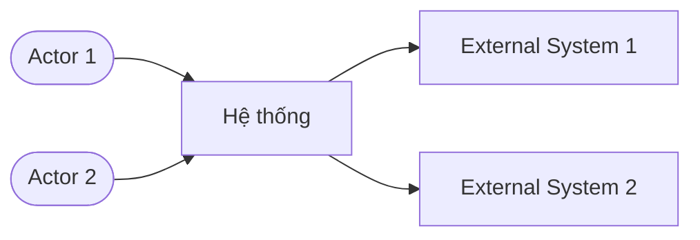
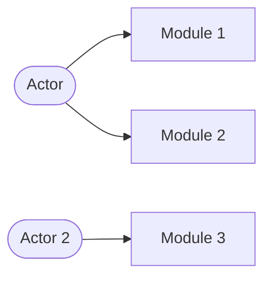

# Software Requirements Specification (SRS)
## {{TÊN HỆ THỐNG}}

| Thông tin | Chi tiết |
|---|---|
| **Dự án** | {{Tên dự án đầy đủ}} |
| **Phiên bản** | {{X.Y}} |
| **Trạng thái** | Draft |
| **Ngày tạo** | {{YYYY-MM-DD}} |
| **Người soạn** | {{Tên / Team}} |
| **Nguồn** | {{Danh sách tài liệu nguồn: PRD, Architecture, BRD, Epics,...}} |

### Lịch sử phiên bản

| Phiên bản | Ngày | Người thực hiện | Nội dung thay đổi |
|---|---|---|---|
| {{X.Y}} | {{YYYY-MM-DD}} | {{Tên}} | {{Mô tả thay đổi}} |

### Bảng phê duyệt

| Vai trò | Họ tên | Chữ ký | Ngày |
|---|---|---|---|
| BA Lead | | | |
| Product Owner | | | |
| CTO / Tech Lead | | | |
| Legal / Compliance | | | |
| UX Lead | | | |

---

## 1. Giới thiệu

### 1.1 Mục đích tài liệu

{{Mô tả mục đích SRS — tài liệu này phục vụ ai, dùng để làm gì}}

Tài liệu phục vụ:
- Làm cơ sở cho thiết kế kỹ thuật (Architecture, SDD)
- Cơ sở viết test plan và test cases
- Xác nhận scope và chức năng với stakeholders
- {{Thêm mục đích khác nếu cần}}

### 1.2 Đối tượng đọc

| Đối tượng | Mục đích sử dụng |
|---|---|
| BA Team | Tài liệu gốc để phát triển và kiểm soát thay đổi |
| Dev Team | Hiểu yêu cầu để thiết kế và lập trình |
| Test Lead | Cơ sở viết test plan và test case |
| Product Owner | Xác nhận scope, phân kỳ |
| {{Thêm đối tượng khác}} | {{Mục đích}} |

### 1.3 Phạm vi hệ thống

**In-scope (MVP — Phase 1):**
- {{Module/Feature 1}} (FR range)
- {{Module/Feature 2}} (FR range)
- ...

**Out-of-scope (Phase 2/3):**
- {{Feature}} — Phase X
- ...

### 1.4 Định nghĩa & Từ viết tắt

| Thuật ngữ / Viết tắt | Giải thích |
|---|---|
| SRS | Software Requirements Specification |
| UC | Use Case |
| FR | Functional Requirement |
| NFR | Non-Functional Requirement |
| BR | Business Rule |
| RTM | Requirements Traceability Matrix |
| {{Thêm thuật ngữ domain}} | {{Giải thích}} |

### 1.5 Tài liệu tham chiếu

| Tài liệu | Phiên bản | Vị trí |
|---|---|---|
| {{Tên tài liệu}} | {{vX.Y}} | {{Đường dẫn}} |
| ... | | |

---

## 2. Tổng quan hệ thống

### 2.1 Mô tả sản phẩm

{{Mô tả tổng quan hệ thống: giải quyết vấn đề gì, mô hình hoạt động, MVP scope}}

### 2.2 Sơ đồ ngữ cảnh hệ thống (System Context Diagram)



### 2.3 Môi trường vận hành

| Hạng mục | Chi tiết |
|---|---|
| Nền tảng | {{Web / Mobile / WebView / API}} |
| Trình duyệt hỗ trợ | {{Chrome X+, Safari X+,...}} |
| Hạ tầng | {{Cloud provider, deployment model}} |
| Backend | {{Tech stack}} |
| Database | {{DB technologies}} |
| Message Broker | {{Nếu có}} |
| API Gateway | {{Nếu có}} |
| Auth | {{Auth solution}} |

### 2.4 Actors và đặc điểm người dùng

| Actor | Mô tả | Tần suất | Kênh | Mức kỹ thuật |
|---|---|---|---|---|
| **{{Persona 1}}** | {{Mô tả}} | {{Tần suất}} | {{Kênh}} | {{Mức}} |
| **{{Persona 2}}** | {{Mô tả}} | {{Tần suất}} | {{Kênh}} | {{Mức}} |

### 2.5 Module Map



| Module | Flows | FRs | Priority |
|---|---|---|---|
| **{{M1: Tên module}}** | Flow XX | FR range | Must Have / Should Have |
| **{{M2: Tên module}}** | Flow XX | FR range | Must Have / Should Have |

### 2.6 Kiến trúc tích hợp

| Hệ thống bên ngoài | Loại | Mục đích | Giao thức | Chiều | SLA |
|---|---|---|---|---|---|
| {{Tên hệ thống}} | Partner / Third-party | {{Mục đích}} | {{REST/SOAP/File}} | Inbound / Outbound / Bidirectional | {{SLA}} |

### 2.7 Giả định và phụ thuộc cấp hệ thống

**Giả định:**
- A1: {{Giả định 1}}
- A2: {{Giả định 2}}

**Phụ thuộc:**
- D1: {{Phụ thuộc 1 — hậu quả nếu không có}}
- D2: {{Phụ thuộc 2 — hậu quả nếu không có}}

---

## 3. Yêu cầu chức năng (Functional Requirements)

> **ID scheme:** `UC-[MODULE]-[NNN]` | **Business Rule:** `BR-[NNN]` | **Thông báo:** `MSG-[NNN]`

### 3.X Module X — {{Tên Module}} (Flow XX)

> **Tài liệu chi tiết:** Xem `srs/SRS-{{code}}-FlowXX-vX.Y.md` (nếu có SRS feature-level riêng)

**Tóm tắt UCs:**

| UC ID | Tên | Actor | Priority | FRs |
|---|---|---|---|---|
| UC-MX-001 | {{Tên UC}} | {{Actor}} | Must Have | {{FR range}} |

---

#### UC-MX-001: {{Tên Use Case}}

| Thông tin | Chi tiết |
|---|---|
| **ID** | UC-MX-001 |
| **Tên** | {{Tên UC}} |
| **Mô tả** | {{Mô tả ngắn gọn}} |
| **Ưu tiên** | Must Have / Should Have / Could Have |
| **Trạng thái** | Draft |
| **Nguồn** | {{PRD vX FR range}} |
| **Actor** | {{Actor chính}} |
| **Kênh** | {{Kênh sử dụng}} |
| **Đường dẫn chức năng** | {{Navigation path}} |
| **Trigger** | {{Sự kiện kích hoạt}} |
| **Tần suất sử dụng** | {{Tần suất}} |
| **Điều kiện tiên quyết** | {{Preconditions}} |

**Luồng chính (Main Flow):**
1. {{Bước 1}}
2. {{Bước 2}}
3. ...

> Khi UC ≥5 bước hoặc ≥2 lần rẽ nhánh, **bắt buộc** kèm sequence diagram và/hoặc activity diagram (PlantUML). Xem mẫu trong `srs-feature-template.md` §3.1, §3.2.

**Luồng thay thế:**
- **Alt-1 — {{Tên}}:** {{Mô tả}}
- **Alt-2 — {{Tên}}:** {{Mô tả}}

**Luồng ngoại lệ:**
- **Exc-1 — {{Tên}}:** {{Mô tả}}

**Hậu điều kiện:**
- Thành công: {{Kết quả khi thành công}}
- Thất bại: {{Kết quả khi thất bại}}

**Yêu cầu dữ liệu:**

| Trường | Kiểu | Bắt buộc | Validation | Ghi chú |
|---|---|---|---|---|
| {{field_name}} | {{String/Integer/Enum/Date/...}} | Có/Không | {{Rule}} | {{Ghi chú}} |

**Business Rules:**

| Mã | Nội dung | Tham chiếu |
|---|---|---|
| BR-XXX | {{Nội dung rule}} | {{PRD/FR/NFR reference}} |

**Các thông báo hệ thống:**

| Mã | Loại | Nội dung | Điều kiện |
|---|---|---|---|
| MSG-XXX | Success/Error/Info/Push | {{Nội dung thông báo}} | {{Điều kiện hiển thị}} |

**Phương pháp kiểm thử:** {{Manual / API test / E2E automation / Integration test / Load test}}

---

> **Lặp lại section 3.X cho mỗi Module. Lặp lại UC block cho mỗi Use Case trong module.**

---

## 4. Yêu cầu phi chức năng (Non-Functional Requirements)

### 4.1 Hiệu năng (Performance)

| ID | Yêu cầu | Tiêu chí chấp nhận |
|---|---|---|
| NFR-PERF-001 | {{Yêu cầu}} | {{p95 / p99 / SLA}} |

### 4.2 Bảo mật (Security)

| ID | Yêu cầu | Tiêu chí chấp nhận |
|---|---|---|
| NFR-SEC-001 | {{Yêu cầu}} | {{Tiêu chí}} |

### 4.3 Khả dụng & Độ tin cậy (Availability)

| ID | Yêu cầu | Tiêu chí chấp nhận |
|---|---|---|
| NFR-AVAIL-001 | {{Yêu cầu}} | {{% uptime}} |
| NFR-REL-001 | RPO | {{< X minutes}} |
| NFR-REL-002 | RTO | {{< X hours}} |

### 4.4 Khả dụng với người dùng (Usability)

| ID | Yêu cầu | Tiêu chí chấp nhận |
|---|---|---|
| NFR-USAB-001 | {{Accessibility — WCAG level}} | {{VD: WCAG 2.1 Level AA cho contrast, font size}} |
| NFR-USAB-002 | {{Learnability — thời gian onboarding}} | {{VD: User hoàn thành task chính trong ≤X phút lần đầu}} |
| NFR-USAB-003 | {{Error recovery — khả năng phục hồi}} | {{VD: Mọi lỗi có hướng dẫn sửa, undo trong ≤X bước}} |
| NFR-USAB-004 | {{Đa ngôn ngữ / Localization}} | {{VD: Hỗ trợ vi-VN, en-US}} |

### 4.5 Khả năng mở rộng (Scalability)

| ID | Yêu cầu | MVP | Year 1 |
|---|---|---|---|
| NFR-SCALE-001 | {{Yêu cầu}} | {{MVP target}} | {{Year 1 target}} |

### 4.7 Tuân thủ quy định (Compliance)

| ID | Yêu cầu | Quy định | Tiêu chí |
|---|---|---|---|
| NFR-COMP-001 | {{Yêu cầu}} | {{Tên quy định}} | {{Tiêu chí}} |

### 4.8 Audit & Ghi log

| ID | Yêu cầu | Tiêu chí |
|---|---|---|
| NFR-AUDIT-001 | {{Scope}} | {{Chi tiết}} |
| NFR-AUDIT-002 | Retention | {{>= X years}} |

### 4.9 Monitoring & Alerting

| ID | Yêu cầu | Tiêu chí |
|---|---|---|
| NFR-MON-001 | {{Dashboard / metric}} | {{Chi tiết}} |

### 4.10 Khả năng bảo trì (Maintainability)

| ID | Yêu cầu | Tiêu chí chấp nhận |
|---|---|---|
| NFR-MAINT-001 | {{Code quality / test coverage}} | {{VD: Unit test coverage ≥X%, SonarQube quality gate pass}} |
| NFR-MAINT-002 | {{Documentation}} | {{VD: API docs auto-generated (OpenAPI 3.x), architecture docs up-to-date}} |
| NFR-MAINT-003 | {{Modular design}} | {{VD: Microservices loosely coupled, thay thế 1 service không ảnh hưởng service khác}} |

### 4.11 Khả năng di chuyển (Portability)

| ID | Yêu cầu | Tiêu chí chấp nhận |
|---|---|---|
| NFR-PORT-001 | {{Platform independence}} | {{VD: Containerized (Docker/K8s), không vendor-locked}} |
| NFR-PORT-002 | {{Database portability}} | {{VD: Dùng standard SQL, tránh vendor-specific extensions}} |
| NFR-PORT-003 | {{Multi-channel support}} | {{VD: API-first, hỗ trợ embed vào host app khác ngoài channel hiện tại}} |

---

## 5. Ràng buộc, Giả định & Phụ thuộc

### 5.1 Ràng buộc kỹ thuật

- {{Ràng buộc tech stack}}
- {{Ràng buộc deployment}}
- {{Ràng buộc infra}}

### 5.2 Ràng buộc quy định pháp lý

- {{Ràng buộc pháp lý 1}}
- {{Ràng buộc pháp lý 2}}

### 5.3 Yêu cầu chuyển đổi (Transition Requirements)

> *(ISO 29148 §6.4 + BABOK v3 §7.4.3 — bắt buộc khi hệ thống thay thế/migrate từ hệ thống cũ)*

| # | Yêu cầu | Mô tả | Owner | Timeline |
|---|---|---|---|---|
| TR-001 | {{Data migration}} | {{VD: Migrate X records từ hệ thống cũ, mapping rules, validation}} | {{Team}} | {{Sprint/Phase}} |
| TR-002 | {{Parallel-run}} | {{VD: Chạy song song old/new system trong X tuần, so sánh output}} | {{Team}} | {{Period}} |
| TR-003 | {{Rollback plan}} | {{VD: Nếu migration fail, rollback trong ≤X giờ, data intact}} | {{Team}} | {{Trigger}} |
| TR-004 | {{User training / communication}} | {{VD: Training cho X users trước go-live, hướng dẫn sử dụng}} | {{Team}} | {{Before go-live}} |

> Nếu không có migration/chuyển đổi, ghi rõ: "Không áp dụng — hệ thống mới hoàn toàn."

### 5.4 Rủi ro ảnh hưởng đến yêu cầu

| Rủi ro | Mức độ | Ảnh hưởng | Biện pháp |
|---|---|---|---|
| {{Rủi ro}} | Cao/Trung bình/Thấp | {{Module/Feature bị ảnh hưởng}} | {{Mitigation}} |

---

## 6. Ma trận truy xuất yêu cầu (RTM)

| PRD FR | UC ID | Module | Màn hình | Epic/Story |
|---|---|---|---|---|
| {{FR ID}} | {{UC ID}} | {{Module}} | {{Screen name}} | {{Epic/Story ref}} |

---

## 7. Phụ lục

### A. Danh sách màn hình (Screen Inventory)

| Màn hình | Module | Figma/Screenshot | UC liên quan |
|---|---|---|---|
| {{Tên màn hình}} | {{Module}} | {{Đường dẫn}} | {{UC ID}} |

### B. Business Rules Index

| Mã | Nội dung | Module | UC |
|---|---|---|---|
| BR-XXX→YYY | {{Nhóm rule}} | {{Module}} | {{UC ID}} |

### C. Open Issues

| # | Vấn đề | Module | Người phụ trách | Hạn | Trạng thái |
|---|---|---|---|---|---|
| OI-X | {{Vấn đề}} | {{Module}} | {{Người}} | {{Deadline}} | Open |

### D. Danh sách thông báo hệ thống (Message Catalog)

| Mã | Loại | Nội dung | UC |
|---|---|---|---|
| MSG-XXX | Success/Error/Info/Push | {{Nội dung}} | {{UC ID}} |

### E. Data Dictionary

> *(ISO 29148 §6.4.3.8 Logical database requirements + BABOK v3 §7.1 Data Models)*

| Thực thể | Thuộc tính | Kiểu dữ liệu | Ràng buộc | Bắt buộc | Mô tả | Hệ thống nguồn |
|---|---|---|---|---|---|---|
| {{Entity}} | {{field_name}} | {{String/Integer/Date/Enum/UUID}} | {{FK, Unique, Check,...}} | Có/Không | {{Mô tả nghiệp vụ}} | {{NTBH / Insurer / Channel}} |

### F. CRUD Matrix

| Use Case | {{Entity 1}} | {{Entity 2}} | {{Entity 3}} | {{Entity 4}} |
|---|---|---|---|---|
| UC-MX-001 | C | R | — | — |
| UC-MX-002 | R | U | C | — |
| UC-MX-003 | — | R | R | D |

> C=Create, R=Read, U=Update, D=Delete, —=Không tác động

### G. State Diagrams — Entity Lifecycle

> *(BABOK v3 §7.1 State Diagrams — bắt buộc cho entities có ≥3 trạng thái)*

**{{Entity name}} Lifecycle:**

```mermaid
stateDiagram-v2
    [*] --> {{State1}}: {{Trigger}}
    {{State1}} --> {{State2}}: {{Event/Action}}
    {{State2}} --> {{State3}}: {{Event/Action}}
    {{State2}} --> {{State4}}: {{Event/Action}}
    {{State3}} --> [*]
    {{State4}} --> [*]
```

| Trạng thái | Mô tả | Trigger chuyển trạng thái | Ai thực hiện |
|---|---|---|---|
| {{State1}} | {{Mô tả}} | {{Event}} | {{Actor/System}} |
| {{State2}} | {{Mô tả}} | {{Event}} | {{Actor/System}} |

> Lặp lại cho mỗi entity có lifecycle phức tạp (VD: Policy, Claim, Transaction, Order, Payment).

### H. Verification Summary

> *(ISO 29148 §6.4.4 — cross-reference giữa requirements và phương pháp kiểm thử)*

| Module | UC ID | Phương pháp kiểm thử | Test Coverage | Ghi chú |
|---|---|---|---|---|
| {{Module}} | UC-MX-001 | {{Manual / API / E2E / Integration / Load / Security}} | {{Unit + Integration + E2E}} | {{Ghi chú đặc biệt}} |
| {{Module}} | UC-MX-002 | {{...}} | {{...}} | |

**Tổng hợp per module:**

| Module | Tổng UC | Manual | API Test | E2E | Integration | Load | Security |
|---|---|---|---|---|---|---|---|
| {{M1}} | {{X}} | {{X}} | {{X}} | {{X}} | {{X}} | {{X}} | {{X}} |

---

*Tài liệu cần review bởi: {{Danh sách reviewer roles}} trước khi baseline.*
