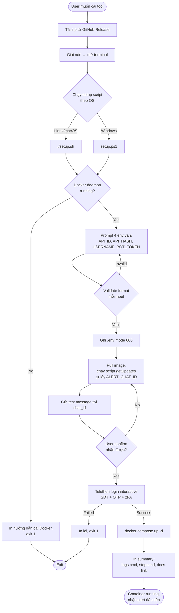
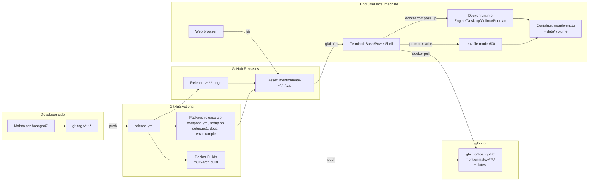
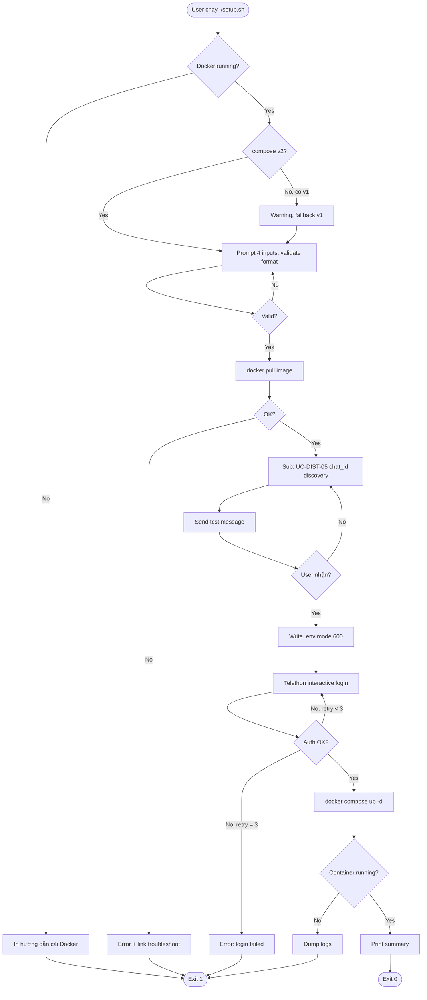
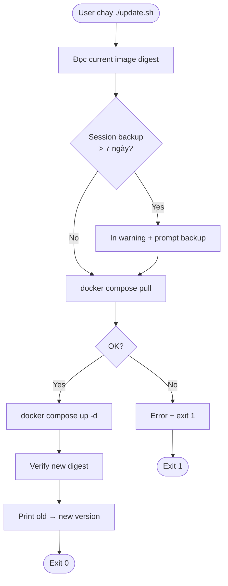
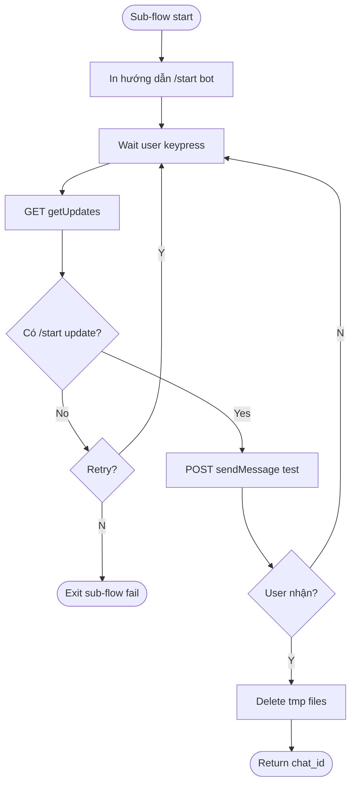
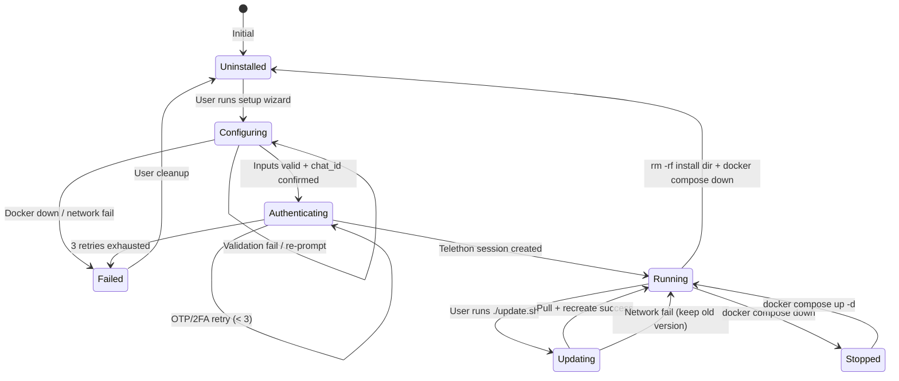
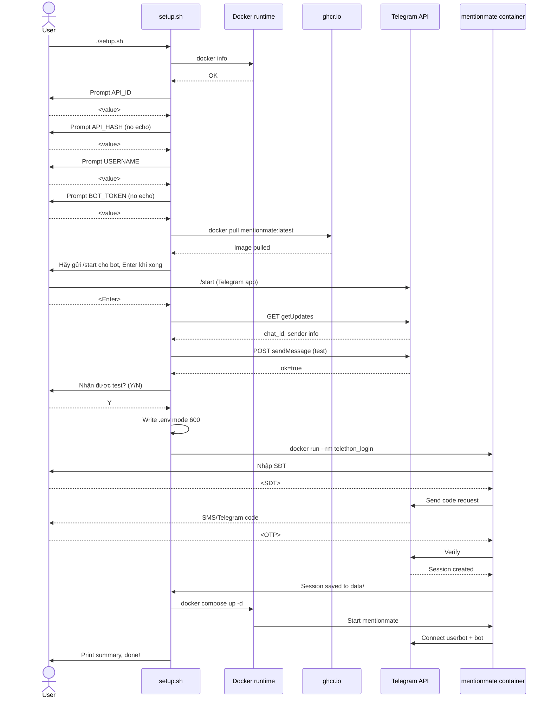

# Flow DIST — Distribution & Install Path

> **Template:** SRS Feature-Level v4 (adapted cho CLI/CI feature — không có UI screens/Figma)
> **Product brand:** **MentionMate** (resolved 2026-05-18; previous codename: `tele-mention-bot`)
> **GitHub repo:** `github.com/hoangp47/mentionmate` (public, resolved 2026-05-18)
> **Container image:** `ghcr.io/hoangp47/mentionmate`
> **Tài liệu nguồn:** PRD-DIST-001 v0.2.0
> **Người soạn:** hoangp47 (BA + Dev) với Claude
> **Ngày:** 2026-05-18

---

## 0. Preamble

### Thông tin tài liệu

| | |
|---|---|
| **Tên tài liệu** | SRS Feature-Level — FR-DIST: Distribution & Install Path |
| **Phiên bản** | 1.0 |
| **Ngày** | 2026-05-18 |
| **Tác giả** | hoangp47 |
| **Trạng thái** | Draft |

### Bảng ghi nhận thay đổi

A – Tạo mới, M – Sửa đổi, D – Xóa bỏ

| Ngày | Vị trí | A/M/D | Nguồn gốc | Mô tả thay đổi | Phiên bản mới |
|---|---|---|---|---|---|
| 2026-05-18 | Toàn bộ | A | PRD-DIST-001 v0.1.0 | Tạo mới SRS Feature-Level cho FR-DIST: Distribution. Gồm 5 use cases (UC-DIST-01 → UC-DIST-05). | 1.0 |
| 2026-05-18 | §11.5 + image refs | M | PRD-DIST-001 v0.2.0 | Resolved GA-DIST-01 (repo public) + GA-DIST-04 (brand MentionMate). Image package: `ghcr.io/hoangp47/mentionmate`. | 1.1 |

### Bảng phê duyệt

| Vai trò | Họ tên | Chữ ký | Ngày |
|---|---|---|---|
| Tác giả | hoangp47 | | |
| Pilot tester (tech) | TBD | | |
| Pilot tester (non-tech) | TBD | | |

---

## 1. Introduction

### 1.1 Purpose

Tài liệu đặc tả yêu cầu phần mềm chi tiết cho **FR-DIST: Distribution & Install Path** của dự án mentionmate. Phạm vi gồm 32 FRs phân thành 5 nhóm (Build pipeline, Setup wizard, Update wizard, Documentation, Configuration) tương ứng với 5 use cases.

| | |
|---|---|
| **Vấn đề cần giải quyết** | Tool hiện chỉ chạy được trên máy tác giả vì setup yêu cầu 6-7 bước thủ công. Cần đóng gói + wizard 1-lệnh để 10-30 user phòng ban (50% non-tech) tự cài được. |
| **Business Goals & Metrics** | M-001: Time-to-first-alert ≤ 15p (tech) / ≤ 30p (non-tech); M-002: Setup success rate ≥ 80% không cần hỏi maintainer. Nguồn: PRD-DIST §10. |
| **Loại chức năng** | ☐ Mobile app ☐ Web app ☑ **Tiến trình (CLI wizard + CI/CD pipeline)** ☐ API |
| **Đường dẫn chức năng** | User: tải zip từ GitHub Release → chạy `./setup.sh` hoặc `setup.ps1` trong terminal. Maintainer: `git tag v0.x.y && git push --tags` |
| **Precondition** | (1) User có Docker runtime đang chạy (Engine/Desktop/Colima/Podman). (2) User có Telegram account để tạo bot + auth userbot. (3) User có internet truy cập được `api.telegram.org` + `ghcr.io`. (4) Maintainer có repo write access + ghcr.io push permission. |
| **Post-condition** | Container `mentionmate` running với image phiên bản đã chọn. File `.env` chứa cấu hình hợp lệ. Session Telethon được lưu tại `data/mentions_session.session` mode 600. Alert đầu tiên đã được test thành công. |
| **Flow liên quan** | Flow CORE (mention detection + alert send — main.py) → **Flow DIST (này)** → Flow OPS (Phase 3, runtime config + digest) |

### 1.2 Scope

**Phạm vi (In-scope):**

| Sub-FR | Chức năng | Phân kỳ |
|---|---|---|
| FR-DIST-01 | Build pipeline (CI): multi-arch image build + push ghcr.io | MVP Bắt buộc |
| FR-DIST-02 | Release pipeline: tạo GitHub Release với zip đính kèm | MVP Bắt buộc |
| FR-DIST-03 | Setup wizard: cross-platform (Bash + PowerShell) | MVP Bắt buộc |
| FR-DIST-04 | Update wizard: pull + recreate container | MVP Bắt buộc |
| FR-DIST-05 | Documentation: README + SETUP + TROUBLESHOOTING + CHANGELOG | MVP Bắt buộc |
| FR-DIST-06 | Container config: docker-compose.yml + restart policy + volume mount | MVP Bắt buộc |

**Ngoài phạm vi (Out-of-scope):**
- Native installer (.exe/.app/.AppImage) — Phương án B, lùi Phase mở rộng > 50 user
- Auto-update từ trong app — Phase 3
- Web UI cho config — Phase 3
- Offline image tarball (workaround firewall) — Out-of-scope theo user decision turn này
- Migration script từ deployment cũ — 1 user duy nhất hiện tại tự migrate

### 1.3 Definitions & Acronyms

| Thuật ngữ | Giải thích |
|---|---|
| Setup wizard | Script tương tác Bash/PowerShell guide user qua các bước cấu hình |
| Update wizard | Script wrapper `docker compose pull && up -d` để cập nhật image |
| ghcr.io | GitHub Container Registry — nơi host Docker image |
| OCI annotation | Open Container Initiative metadata embed trong image (vd `org.opencontainers.image.source`) |
| Multi-arch image | Image build cho cả `linux/amd64` và `linux/arm64`, đăng ký dưới cùng tag |
| Telethon session | File binary chứa auth key cho user account Telegram (4096 bytes typical) |
| Bot Token | Chuỗi `<id>:<secret>` cấp bởi @BotFather, dùng cho Bot HTTP API |
| chat_id | Định danh số của chat Telegram (user/group/channel); negative cho group |
| ExecutionPolicy | Cơ chế Windows PowerShell quyết định script nào được phép chạy |
| BotFather | Tài khoản Telegram chính thức (`@BotFather`) để tạo và quản lý bot |
| WSL2 | Windows Subsystem for Linux v2 — Linux kernel ảo hoá trên Windows |
| Colima | Lightweight container runtime cho macOS, alternative cho Docker Desktop |
| Podman | Container engine alternative cho Docker, free cho commercial use |
| SemVer | Semantic Versioning `MAJOR.MINOR.PATCH` (vd `v0.1.0`) |

### 1.4 References

| Tài liệu | Phiên bản | Vị trí |
|---|---|---|
| PRD Distribution | v0.1.0 | `.vsaf/docs/planning-artifacts/prd-distribution.md` |
| Analysis report + roadmap | v1 | `/home/hoangp47/.claude/plans/gleaming-soaring-moore.md` |
| Source main.py | git 481257c | `/home/hoangp47/working/tools/tele/main.py` |
| Dockerfile (current) | git 481257c | `/home/hoangp47/working/tools/tele/Dockerfile` |
| Telethon docs | 1.33.1 | https://docs.telethon.dev/ |
| Telegram Bot API | as of 2026-05 | https://core.telegram.org/bots/api |
| GitHub Actions docker/build-push | v5 | https://github.com/docker/build-push-action |
| OCI Image Spec | v1.1.0 | https://github.com/opencontainers/image-spec |

---

## 2. Business Context

### 2.1 Business Goals

| Metric ID | Chỉ số | Mục tiêu | Nguồn |
|---|---|---|---|
| M-001 | Time-to-first-alert (new user) | ≤ 15p tech / ≤ 30p non-tech | PRD §10 |
| M-002 | Setup success rate (no help) | ≥ 80% pilot 5 user/nhóm | PRD §10 |
| M-003 | Adoption rate 30 ngày | ≥ 10 active user phòng ban | PRD §10 |
| M-004 | Update adoption 14 ngày | ≥ 70% | PRD §10 |
| M-006 | CI workflow success rate | ≥ 95% / 20 release | PRD §10 |

**Mục tiêu nghiệp vụ:**
- Giảm barrier onboarding để tool nhân rộng đến đồng nghiệp không phải DevOps.
- Tự động hoá build + release để tác giả không phải làm thủ công mỗi version.
- Cung cấp update path 1-lệnh để user không bị stuck ở version cũ.

### 2.2 Stakeholders

| Stakeholder | Vai trò | Quyền lợi |
|---|---|---|
| hoangp47 | Tác giả + maintainer | Tool nhân rộng, dự thi Sáng kiến, học sản phẩm hoá |
| Đồng nghiệp DevOps phòng ban | Early adopter | Nhận tool stable, giúp test |
| Đồng nghiệp non-tech phòng ban | Target user | Có công cụ giảm miss mention mà không cần biết Docker |
| Ban tổ chức Sáng kiến Viettel | Đánh giá | Sản phẩm có demo, có user thật |
| Phòng ATTT Viettel (gián tiếp) | Compliance | Tool không leak dữ liệu công việc ra ngoài |

### 2.3 Actors / User Roles

| Actor | Mô tả | Quyền hạn trong DIST flow |
|---|---|---|
| **End User (tech)** | DevOps/dev, quen CLI, quen Docker | Chạy `./setup.sh`, `./update.sh`, đọc log container |
| **End User (non-tech)** | PM/BA/QA, không quen CLI | Chạy wizard với hướng dẫn screenshot |
| **Maintainer** | Tác giả tool | Push git tag để trigger release; quản lý ghcr.io permissions |
| **ES: ghcr.io** | GitHub Container Registry | Lưu image, serve pull request |
| **ES: GitHub** | Git hosting + Actions runner | Trigger workflow, host Release zip |
| **ES: Telegram API** | Telegram service | Đáp ứng BotFather, getUpdates, sendMessage; userbot login |
| **ES: Docker runtime** | Local Docker engine | Pull image, run container, mount volumes |

### 2.4 Channels

- **Terminal/CLI** (Bash trên Linux/macOS; PowerShell trên Windows) — kênh chính cho setup/update wizard.
- **GitHub Releases page** — nơi user tải zip.
- **GitHub Actions CI** — kênh maintainer trigger build.

### 2.5 Assumptions

- **ASM-01:** User có Docker runtime đang chạy (Engine/Desktop/Colima/Podman). — User tự xác minh trước khi chạy wizard.
- **ASM-02:** User có internet kết nối được `api.telegram.org` 24/7 và `ghcr.io`/`github.com` ít nhất lúc cài đặt. — User responsibility.
- **ASM-03:** Telegram chấp nhận account user tạo bot mới qua @BotFather không bị rate limit. — Telegram side; mitigated bằng stagger rollout.
- **ASM-04:** Telethon library `1.33.1+` tiếp tục support session file format hiện tại. — Pin version trong requirements.
- **ASM-05:** ghcr.io tiếp tục miễn phí cho public package. — GitHub policy; mitigation: migrate Docker Hub nếu thay đổi.
- **ASM-06:** GitHub Actions free tier (public repo: unlimited) đủ cho 1-2 release/tuần. — Đo thực tế sau pilot.
- **ASM-07:** Bash 4+ và PowerShell 5.1+ available trên target OS (Ubuntu 22.04+, macOS 13+, Windows 10/11). — Standard.

### 2.6 Dependencies

- **External services:** ghcr.io (registry), GitHub Actions (CI), Telegram API DC1-DC5.
- **External libraries (image runtime):** `telethon==1.33.1`, `aiohttp==3.9.5`, `python-dotenv==1.0.1`, Python 3.11.
- **External tools (build time):** Docker buildx (multi-arch), GitHub Actions runner Ubuntu 22.04.
- **Flow dependencies:** DIST không phụ thuộc CORE (main.py) — vẫn build được khi main.py có lỗi runtime; nhưng pilot test cần CORE chạy đúng.

---

## 3. System Overview

### 3.1 System Description

DIST là layer **đóng gói + phân phối + cài đặt** đứng trước CORE (main.py). Không thay đổi runtime logic; chỉ thêm artifacts xung quanh:
- Build pipeline tạo image multi-arch + zip release.
- Wizard scripts hướng dẫn user qua các bước cấu hình + auth Telegram.
- Update wrapper.
- Documentation.

| | |
|---|---|
| **Module thuộc về** | mentionmate — packaging layer |
| **Bối cảnh pháp lý** | Tool truy cập tin nhắn Telegram cá nhân của user → user tự chịu trách nhiệm. DIST chỉ là layer cài đặt, không lưu nội dung tin nhắn ra ngoài máy user. Tuân thủ chính sách Viettel về sử dụng userbot cần verify riêng với ATTT. |

### 3.2 High-Level Flow



### 3.3 Architecture Overview



**Nguyên tắc nền tảng:**
- **No code change in main.py** — DIST chỉ thêm artifacts xung quanh CORE.
- **Image immutable per version** — đã build và push v0.1.0 thì không bao giờ replace.
- **State chỉ ở 2 nơi:** `.env` (user-side, không commit) + `data/mentions_session.session` (user-side, mounted volume).
- **Wizard idempotent** — chạy lại không phá state cũ trừ khi user confirm.
- **Maintainer-free release** — push tag là xong, không can thiệp manual.

---

## 4. Data Model

> Flow này không có DB schema; chỉ có file artifacts. Liệt kê ở đây để traceability.

### 4.1 Artifact List

| Artifact | Vị trí | Mô tả | Owner |
|---|---|---|---|
| `.env` | `<install-dir>/.env` | Chứa 5 env vars cấu hình | User local |
| `mentions_session.session` | `<install-dir>/data/mentions_session.session` | Telethon auth session binary | User local |
| `docker-compose.yml` | `<install-dir>/docker-compose.yml` | Service definition | Repo template |
| Docker image | `ghcr.io/hoangp47/mentionmate:vX.Y.Z` | Multi-arch Python runtime image | Registry |
| Release zip | GitHub Release asset | Bundle setup scripts + docs | GitHub |

### 4.2 .env Schema

| Field | Type | Required | Pattern | Mô tả |
|---|---|---|---|---|
| `TG_API_ID` | integer | ✅ | `^\d+$` | API_ID từ my.telegram.org/apps |
| `TG_API_HASH` | string | ✅ | `^[a-f0-9]{32}$` | API_HASH từ my.telegram.org/apps (32 hex chars) |
| `TG_MY_USERNAME` | string | ✅ | `^[A-Za-z][A-Za-z0-9_]{4,31}$` | Username Telegram (không có @, 5-32 chars) |
| `TG_BOT_TOKEN` | string | ✅ | `^\d+:[A-Za-z0-9_-]{30,40}$` | Bot token từ @BotFather |
| `TG_ALERT_CHAT_ID` | integer | ✅ | `^-?\d+$` | chat_id để gửi alert (có thể âm cho group) |

> **Constraint:** File `.env` POSIX mode 600 (`-rw-------`); Windows ACL tương đương (chỉ user owner đọc).

### 4.3 Docker Compose Schema (excerpt)

```yaml
version: "3.8"
services:
  bot:
    image: ghcr.io/hoangp47/mentionmate:latest
    container_name: mentionmate
    restart: unless-stopped
    env_file: .env
    volumes:
      - ./data:/app/data
    healthcheck:
      test: ["CMD-SHELL", "pgrep -f 'python.*main.py' || exit 1"]
      interval: 30s
      timeout: 5s
      retries: 3
    mem_limit: 256m
    cpus: 0.5
```

### 4.4 Image OCI Labels (build-time)

| Label | Giá trị | Mục đích |
|---|---|---|
| `org.opencontainers.image.source` | `https://github.com/hoangp47/mentionmate` | Link image với repo trên ghcr.io UI |
| `org.opencontainers.image.version` | `v0.x.y` | Phiên bản |
| `org.opencontainers.image.created` | ISO timestamp | Build time |
| `org.opencontainers.image.revision` | git SHA | Reproducibility |
| `org.opencontainers.image.title` | `mentionmate` | Tên |
| `org.opencontainers.image.description` | "Telegram mention alert daemon" | Mô tả |

### 4.5 Events (CI workflow triggers)

| Trigger | Source | Action |
|---|---|---|
| `push` matching `refs/tags/v*.*.*` | git | Chạy release.yml: build + push + release |
| `pull_request` to `master` | git | Chạy lint.yml: shellcheck + hadolint + python lint (out of scope SRS này — Phase Hardening) |

### 4.6 API Endpoints (external used)

| Method | Endpoint | Service | Mô tả | Auth |
|---|---|---|---|---|
| `GET` | `https://api.telegram.org/bot<token>/getUpdates` | Telegram | Lấy danh sách update cho bot, dùng phát hiện chat_id | Bot token |
| `POST` | `https://api.telegram.org/bot<token>/sendMessage` | Telegram | Gửi test message + alert | Bot token |
| `GET` | `https://ghcr.io/v2/hoangp47/mentionmate/manifests/<tag>` | ghcr.io | Pull image manifest | Anonymous (public) |
| `GET` | `https://api.github.com/repos/hoangp47/mentionmate/releases/latest` | GitHub | (Phase 3, optional) check update | Anonymous |

---

## 5. Functional Requirements

### 5.1 Use Case List

| UC ID | Tên | Actor | Priority | FRs | Phương pháp kiểm thử |
|---|---|---|---|---|---|
| UC-DIST-01 | First-time setup (Linux/macOS) | End User tech/non-tech | Must Have | FR-010 → FR-020 | Manual E2E |
| UC-DIST-02 | First-time setup (Windows) | End User tech/non-tech | Must Have | FR-010 → FR-020 | Manual E2E |
| UC-DIST-03 | Update existing install | End User any | Must Have | FR-030 → FR-032 | Manual E2E |
| UC-DIST-04 | Release new version | Maintainer | Must Have | FR-001 → FR-006 | CI integration |
| UC-DIST-05 | Telegram chat_id discovery + verify | End User any (sub-flow của UC-01/02) | Must Have | FR-015, FR-016 | Manual + unit |

### 5.2 Use Case Detail

> Không có Figma — đây là CLI/CI feature. Mỗi UC mô tả wizard steps thay cho screens.

---

#### UC-DIST-01: First-time setup trên Linux/macOS

**Mô tả ngắn:** User mới tải zip về, giải nén, mở terminal trong thư mục, chạy `./setup.sh`. Wizard guide qua các bước, kết thúc bằng container running và alert đầu tiên.

**Precondition:**
- User đã tạo bot qua @BotFather, có sẵn 4 thông tin: API_ID, API_HASH, Username, Bot Token.
- Docker daemon đang chạy.
- Internet truy cập được `api.telegram.org` và `ghcr.io`.

**Postcondition:**
- File `.env` chứa 5 env vars valid (4 input + 1 auto-discovered chat_id), mode 600.
- File `data/mentions_session.session` mode 600.
- Container `mentionmate` status `running`.
- User đã nhận được test message do wizard gửi.

##### Wizard Steps SCR-DIST-01

> Mỗi step có: ID, prompt text hiển thị cho user, validation rule, action.

| STT | Step ID | Prompt / Action | Loại | Validation | Action ngay |
|---|---|---|---|---|---|
| 1 | `step_check_docker` | "🔍 Đang kiểm tra Docker daemon..." | Auto check | `docker info` exit 0 | Nếu fail: in lỗi + link cài đặt Docker theo OS, exit 1 |
| 2 | `step_check_compose` | "🔍 Đang kiểm tra docker compose v2..." | Auto check | `docker compose version` exit 0 | Nếu fail: warning + tiếp tục với fallback `docker-compose` v1 |
| 3 | `prompt_api_id` | "🔑 Nhập TG_API_ID (lấy từ https://my.telegram.org/apps):" | Text input | `^\d+$` | Re-prompt với message "TG_API_ID phải là số nguyên" nếu invalid |
| 4 | `prompt_api_hash` | "🔑 Nhập TG_API_HASH (32 ký tự hex từ cùng trang):" | Password input (no echo) | `^[a-f0-9]{32}$` | Re-prompt nếu format sai |
| 5 | `prompt_username` | "👤 Nhập username Telegram của bạn (không có @):" | Text input | `^[A-Za-z][A-Za-z0-9_]{4,31}$` | Re-prompt nếu format sai |
| 6 | `prompt_bot_token` | "🤖 Nhập TG_BOT_TOKEN (lấy từ @BotFather sau lệnh /newbot):" | Password input (no echo) | `^\d+:[A-Za-z0-9_-]{30,40}$` | Re-prompt nếu format sai |
| 7 | `step_pull_image` | "⬇️ Đang pull image ghcr.io/hoangp47/mentionmate:latest..." | Auto action | Pull thành công, exit 0 | Nếu fail (network/firewall): in error + link troubleshoot, exit 1 |
| 8 | `step_discover_chat` | "🔍 Tìm chat_id alert: vui lòng mở Telegram, tìm bot vừa tạo, gửi `/start`. Đã gửi? (Enter để tiếp tục)" | Wait for keypress + auto action (sub-flow UC-DIST-05) | Tìm thấy ≥ 1 chat_id trong getUpdates | Nếu không thấy: prompt "Bạn chưa /start với bot? Thử lại (Y/N)" |
| 9 | `step_send_test` | "📤 Đang gửi test message tới chat_id <ID>..." + "Bạn có nhận được 'Setup test' trên Telegram không? (Y/N)" | Auto send + manual confirm | User nhập Y | Nếu N: quay lại step 8 (chat_id sai, có thể user /start sai bot) |
| 10 | `step_write_env` | "💾 Đang ghi .env với mode 600..." | Auto write | File `.env` exists, perm `600` | Nếu fail (read-only fs): in error, exit 1 |
| 11 | `step_telethon_auth` | "🔐 Đăng nhập userbot Telegram (yêu cầu SĐT + OTP + 2FA nếu có)..." (sub-flow Telethon interactive) | Interactive | Session file tạo thành công | Nếu fail (sai OTP, 2FA): cho phép retry 3 lần, sau đó exit 1 |
| 12 | `step_start_container` | "🚀 Đang khởi động container..." (`docker compose up -d`) | Auto action | Container status `running` trong 10s | Nếu fail: dump logs container, exit 1 |
| 13 | `step_summary` | In summary: container name, lệnh xem log, lệnh stop, link docs | Text output | — | Exit 0 |

##### Activity Diagram — UC-DIST-01



##### Mô tả luồng nghiệp vụ

| Bước | Đối tượng | Mô tả | Ghi chú | Artifact liên quan |
|---|---|---|---|---|
| 1 | Wizard | Auto detect Docker via `docker info` | BR-DIST-01-01. EF: ERR-DIST-001 nếu daemon down. | — |
| 2 | Wizard | Auto detect compose v2 via `docker compose version` | Cảnh báo nếu v1 nhưng tiếp tục. | — |
| 3-6 | User + Wizard | Prompt 4 env vars sequential với validation in-line | BR-DIST-01-02. Re-prompt vô hạn lần đến khi valid. | `.env` (chưa ghi) |
| 7 | Wizard + ES:ghcr.io | Pull image `:latest` (hoặc tag từ release zip nếu có) | EF: ERR-DIST-002 nếu network fail. | Image local |
| 8 | Wizard + ES:Telegram + User | Sub-flow UC-DIST-05: chạy temp container gọi `getUpdates`, parse chat_id của user vừa /start | BR-DIST-05-01. AF: chat_id không tìm thấy → user retry. | `data/.tmp_updates.json` (cleanup sau) |
| 9 | Wizard + ES:Telegram | Gửi test message qua `sendMessage` API | BR-DIST-05-02. AF: User trả N → loop về step 8. | — |
| 10 | Wizard | Write `.env` với 5 fields, set permission 600 (POSIX) | BR-DIST-01-03. | `.env` |
| 11 | Wizard + User + ES:Telegram | Telethon `start()` interactive — prompt SĐT, OTP, optional 2FA password | EF: ERR-DIST-003 nếu auth fail 3 lần. | `data/mentions_session.session` |
| 12 | Wizard | `docker compose up -d` | EF: ERR-DIST-004 nếu container không start. | Container |
| 13 | Wizard | Print summary | — | — |

**Luồng thay thế:**
- **ALT1 (Wizard re-run):** Nếu user chạy lại `./setup.sh` khi đã có `.env` và session: wizard detect, prompt "Đã có cấu hình. Overwrite (Y/N)?" Default N → exit gracefully.
- **ALT2 (Compose v1 fallback):** Bước 2 detect chỉ có `docker-compose` v1 → wizard dùng `docker-compose` (gạch nối) thay vì `docker compose` (space) cho mọi lệnh tiếp theo.

**Luồng ngoại lệ:**
- **EX1 (Docker daemon down):** ERR-DIST-001 → "Docker chưa chạy. Vui lòng start Docker rồi thử lại. Cài đặt: https://docs.docker.com/engine/install/" → exit 1.
- **EX2 (Network fail khi pull):** ERR-DIST-002 → "Không pull được image. Kiểm tra mạng truy cập ghcr.io. Xem TROUBLESHOOTING.md §Network." → exit 1.
- **EX3 (Telethon auth fail 3 lần):** ERR-DIST-003 → "Không đăng nhập được Telethon sau 3 lần. Có thể do sai OTP, sai 2FA, hoặc Telegram tạm khoá account. Xem TROUBLESHOOTING.md §Auth." → exit 1.
- **EX4 (Container không start):** ERR-DIST-004 → dump 50 dòng log cuối + "Container không khởi động được. Logs ở trên có thể giúp chẩn đoán." → exit 1.

**Mapping Epic:** Story E-2.S-1, E-2.S-3, E-2.S-4, E-2.S-5 (Epic E-2 Setup Wizard).

---

#### UC-DIST-02: First-time setup trên Windows (PowerShell)

**Mô tả ngắn:** Giống UC-DIST-01 nhưng chạy `setup.ps1` trong PowerShell.

**Khác biệt với UC-DIST-01:**

| Tiêu chí | Bash (UC-01) | PowerShell (UC-02) |
|---|---|---|
| Lệnh chạy | `./setup.sh` | `.\setup.ps1` hoặc `powershell -ExecutionPolicy Bypass -File setup.ps1` |
| File permission | `chmod 600` thực tế | `icacls` set ACL chỉ user owner đọc (best-effort; Windows file perm semantics khác POSIX) |
| Path separator | `/` | `\` |
| User input no-echo | `read -s` (Bash) | `Read-Host -AsSecureString` (PS) + `ConvertFrom-SecureString` |
| Exit code | `exit 1` | `exit 1` (same) |
| ExecutionPolicy guard | N/A | Wizard kiểm tra `Get-ExecutionPolicy`, nếu `Restricted` → in hướng dẫn `Set-ExecutionPolicy -Scope Process Bypass` |

##### Wizard Steps SCR-DIST-02

Reference Wizard Steps SCR-DIST-01 cho thứ tự bước. Khác biệt:
- Bước 0 (PowerShell only): Check ExecutionPolicy. Nếu `Restricted` → in lệnh fix + exit 1.
- Bước 10: Dùng `icacls "$env_path" /inheritance:r /grant:r "$env:USERNAME:(R,W)"` thay cho `chmod 600`.

##### Activity Diagram — UC-DIST-02

Same as UC-DIST-01 với thêm node "Check ExecutionPolicy" ở đầu chain trước "Check Docker".

**Luồng ngoại lệ:**
- **EX5 (ExecutionPolicy Restricted):** ERR-DIST-005 → "PowerShell đang chặn script chưa sign. Chạy lệnh sau rồi thử lại: `Set-ExecutionPolicy -Scope Process Bypass`. Xem SETUP.md §Windows." → exit 1.

**Mapping Epic:** Story E-2.S-2 (Epic E-2 Setup Wizard).

---

#### UC-DIST-03: Update existing install

**Mô tả ngắn:** User đã cài v0.x.y, muốn lên v0.x.(y+1). Chạy `./update.sh` hoặc `update.ps1`.

**Precondition:**
- Tool đã được cài đặt thành công qua UC-DIST-01 hoặc UC-DIST-02.
- `docker-compose.yml` exists, `.env` valid, `data/mentions_session.session` valid.
- Internet kết nối được ghcr.io.

**Postcondition:**
- Container chạy với image phiên bản mới (image digest khác trước).
- Session file không bị mất.
- `.env` không bị mất.

##### Wizard Steps SCR-DIST-03

| STT | Step ID | Prompt / Action | Action |
|---|---|---|---|
| 1 | `step_show_current` | "📍 Phiên bản hiện tại: <current_tag>" | Đọc digest từ `docker inspect mentionmate` → resolve tag |
| 2 | `step_warn_backup` | "⚠️ Phát hiện session file chưa backup trong 7 ngày qua. Backup ngay? (Y/N) [N]" | Chỉ in nếu `data/mentions_session.session` mtime > 7 ngày |
| 3 | `step_pull` | "⬇️ Đang pull image mới..." | `docker compose pull` |
| 4 | `step_check_new` | "📦 Phiên bản mới: <new_tag>" | Đọc digest mới |
| 5 | `step_recreate` | "🔄 Đang recreate container..." | `docker compose up -d` |
| 6 | `step_verify` | "✅ Container đang chạy với image mới." | Verify `docker inspect` digest khớp new |
| 7 | `step_summary` | "Update xong. Phiên bản: <old> → <new>." | Exit 0 |

##### Activity Diagram — UC-DIST-03



**Mô tả luồng nghiệp vụ:**

| Bước | Đối tượng | Mô tả | Ghi chú |
|---|---|---|---|
| 1 | Wizard | `docker inspect mentionmate --format '{{.Image}}'` → resolve image digest → reverse-lookup tag | BR-DIST-03-01 |
| 2 | Wizard | Stat session file mtime, so sánh now() - 7 days | Mitigation cho R-005 |
| 3 | Wizard + ES:ghcr.io | `docker compose pull` | EF: ERR-DIST-002 nếu network fail |
| 4 | Wizard | Đọc digest sau pull, so sánh trước | Nếu giống: in "Đã ở phiên bản mới nhất, không cần update", exit 0 |
| 5 | Wizard | `docker compose up -d` recreate container với image mới | Telethon session tự reconnect nhờ volume mount giữ nguyên |
| 6 | Wizard | Verify digest container sau khớp digest pulled | EF: ERR-DIST-006 nếu vẫn dùng image cũ |
| 7 | Wizard | Print summary với version diff | — |

**Luồng thay thế:**
- **ALT1 (Already up-to-date):** Bước 4 detect digest không đổi → in "Đã ở phiên bản mới nhất", exit 0.
- **ALT2 (Backup confirmed):** Bước 2 user trả Y → wizard chạy `cp data/mentions_session.session data/mentions_session.backup.<timestamp>`.

**Luồng ngoại lệ:**
- **EX1 (Network fail pull):** ERR-DIST-002 → cùng UC-DIST-01 EX2.
- **EX2 (Container không up sau recreate):** ERR-DIST-006 → "Update đã pull image nhưng container không khởi động lại. Rollback bằng: `docker compose up -d` với tag cũ. Xem TROUBLESHOOTING.md §Update."

**Mapping Epic:** Story E-3.S-1, E-3.S-2, E-3.S-3 (Epic E-3 Update Mechanism).

---

#### UC-DIST-04: Release new version (Maintainer)

**Mô tả ngắn:** Maintainer push git tag `v0.x.y` → GitHub Actions tự build multi-arch image, push ghcr.io, tạo release với zip đính kèm.

**Precondition:**
- Maintainer có write access repo + ghcr.io push permission qua `GITHUB_TOKEN` mặc định.
- CHANGELOG.md đã có section cho version sắp release.
- Branch `master` đã ổn định (lint pass, test pass nếu có).

**Postcondition:**
- Image `ghcr.io/hoangp47/mentionmate:v0.x.y` và `:latest` tồn tại trên registry với cả linux/amd64 và linux/arm64.
- GitHub Release page có asset `mentionmate-v0.x.y.zip`.
- Release notes auto-generated từ CHANGELOG.md.

##### Workflow Steps (release.yml)

| STT | Step ID | Action | Trigger / Tool |
|---|---|---|---|
| 1 | `checkout` | Checkout repo at tag commit | `actions/checkout@v4` |
| 2 | `setup_buildx` | Setup Docker Buildx | `docker/setup-buildx-action@v3` |
| 3 | `login_ghcr` | Login to ghcr.io with `GITHUB_TOKEN` | `docker/login-action@v3` |
| 4 | `extract_meta` | Generate tags + OCI labels | `docker/metadata-action@v5`, tags: `type=semver,pattern={{version}}` + `latest` |
| 5 | `build_push` | Build multi-arch (linux/amd64, linux/arm64) + push | `docker/build-push-action@v5`, platforms từ matrix |
| 6 | `prepare_zip` | Tạo thư mục `dist/`, copy `docker-compose.yml`, `setup.sh`, `setup.ps1`, `update.sh`, `update.ps1`, `.env.example`, `README.md`, `docs/` vào | Bash script |
| 7 | `zip_assets` | `zip -r mentionmate-${TAG}.zip dist/` | Bash |
| 8 | `extract_changelog` | Parse CHANGELOG.md section for current version | Bash + grep/awk |
| 9 | `create_release` | Create GitHub Release with zip asset and notes | `softprops/action-gh-release@v2` |

##### Activity Diagram — UC-DIST-04

```mermaid
flowchart TD
    Start([git tag v0.x.y push]) --> Trigger[GitHub Actions trigger release.yml]
    Trigger --> Checkout[actions/checkout@v4]
    Checkout --> Buildx[Setup Docker Buildx]
    Buildx --> Login[Login ghcr.io with GITHUB_TOKEN]
    Login --> Meta[Generate tags + OCI labels]
    Meta --> Build[Build linux/amd64 + linux/arm64]
    Build --> Push[Push image to ghcr.io]
    Push --> PrepareZip[Copy artifacts to dist/]
    PrepareZip --> Zip[Create release zip]
    Zip --> Changelog[Extract CHANGELOG section]
    Changelog --> CreateRelease[Create GitHub Release with zip + notes]
    CreateRelease --> End([Release published])

    Build -->|fail| FailBuild[Workflow failed]
    Push -->|fail| FailPush[Workflow failed]
    CreateRelease -->|fail| FailRelease[Workflow failed]
```

**Mô tả luồng nghiệp vụ:**

| Bước | Đối tượng | Mô tả | Ghi chú |
|---|---|---|---|
| 1 | GitHub Actions runner | Checkout repo tại tag commit | BR-DIST-04-01 |
| 2 | Runner + Buildx | Init buildx builder hỗ trợ multi-arch | — |
| 3 | Runner + ES:ghcr.io | Login với `GITHUB_TOKEN` | Permissions: `packages: write` trong workflow |
| 4 | metadata-action | Generate tags: `:v0.x.y`, `:latest`, OCI labels từ git context | BR-DIST-04-02 |
| 5 | build-push-action | Build image cho 2 arch, push lên ghcr.io | EF: ERR-DIST-007 nếu build fail (vd Dockerfile lỗi) |
| 6 | Runner | Copy artifacts vào dist/ | BR-DIST-04-03 |
| 7 | Runner | Zip với tên `mentionmate-${GITHUB_REF_NAME}.zip` | — |
| 8 | Runner | Parse CHANGELOG.md tìm section `## [v0.x.y]` đến section kế tiếp | EF: ERR-DIST-008 nếu không tìm thấy section |
| 9 | gh-release-action | Tạo release với body từ changelog, attach zip | EF: ERR-DIST-009 nếu API rate limit |

**Luồng thay thế:**
- **ALT1 (Pre-release):** Tag matching `v0.x.y-rc1` → release marked `prerelease: true`.

**Luồng ngoại lệ:**
- **EX1 (Build fail):** ERR-DIST-007 → Workflow log có Dockerfile error; maintainer fix locally, retry tag.
- **EX2 (CHANGELOG missing):** ERR-DIST-008 → Use empty release notes + warning; maintainer add section sau và rebuild release notes manual.
- **EX3 (Release create fail):** ERR-DIST-009 → Retry sau 5p; manual upload zip nếu cần.

**Mapping Epic:** Story E-1.S-1, E-1.S-2, E-1.S-3, E-1.S-4 (Epic E-1 CI/CD Pipeline).

---

#### UC-DIST-05: Telegram chat_id discovery + verify

**Mô tả ngắn:** Sub-flow của UC-DIST-01/02. Wizard tự phát hiện `TG_ALERT_CHAT_ID` bằng cách yêu cầu user gửi `/start` cho bot, sau đó gọi `getUpdates` parse chat_id, gửi test message confirm.

**Precondition:**
- Wizard đã có `TG_BOT_TOKEN` valid (từ step 6 UC-01/02).
- Image đã pull (từ step 7).
- Internet kết nối được `api.telegram.org`.

**Postcondition:**
- Biến `TG_ALERT_CHAT_ID` đã được set với chat_id confirmed bằng test message.
- File `data/.tmp_updates.json` (nếu có) đã được cleanup.

##### Steps

| STT | Step ID | Action |
|---|---|---|
| 1 | `step_instruct` | In hướng dẫn: "Mở Telegram trên điện thoại, tìm bot có username `@<bot_username>` (có thể tìm thấy qua link t.me/<bot_username>), gửi `/start`. Khi xong, nhấn Enter để tiếp tục." |
| 2 | `step_wait_user` | Đọc keypress (Bash: `read -n 1`; PS: `Read-Host`) |
| 3 | `step_call_getupdates` | `curl -s https://api.telegram.org/bot${BOT_TOKEN}/getUpdates` |
| 4 | `step_parse_chat_id` | Parse JSON, lấy `chat.id` của update đầu tiên có `message.text == "/start"` từ user (`from.is_bot == false`) |
| 5 | `step_validate` | Nếu không tìm thấy: prompt "Chưa thấy /start. Bạn đã gửi đúng bot chưa? Thử lại (Y/N)?" |
| 6 | `step_send_test` | `curl -X POST https://api.telegram.org/bot${BOT_TOKEN}/sendMessage -d chat_id=<id> -d text="🔧 Setup test"` |
| 7 | `step_confirm` | Prompt user: "Bạn có nhận được tin nhắn 'Setup test'? (Y/N)" |
| 8 | `step_cleanup` | Xoá `.tmp_updates.json` nếu có |

##### Activity Diagram — UC-DIST-05



**Mapping Epic:** Story E-2.S-4 (Verify chat_id with test message).

---

### 5.3 Acceptance Criteria

| AC ID | UC | Given / When / Then |
|---|---|---|
| AC-FR-DIST-01 | UC-DIST-01 | **Given** user có Docker chạy + 4 thông tin valid, **When** chạy `./setup.sh` end-to-end, **Then** trong ≤ 15 phút container running và alert test được nhận. |
| AC-FR-DIST-02 | UC-DIST-01 | **Given** Docker daemon down, **When** chạy `./setup.sh`, **Then** wizard in ERR-DIST-001 với link cài Docker theo OS và exit 1, **KHÔNG** ghi `.env`. |
| AC-FR-DIST-03 | UC-DIST-01 | **Given** user nhập "abc" cho TG_API_ID, **When** validation chạy, **Then** wizard re-prompt với "TG_API_ID phải là số nguyên" không advance bước. |
| AC-FR-DIST-04 | UC-DIST-02 | **Given** Windows với ExecutionPolicy=Restricted, **When** chạy `.\setup.ps1`, **Then** wizard in ERR-DIST-005 với lệnh fix và exit 1. |
| AC-FR-DIST-05 | UC-DIST-03 | **Given** container đang chạy v0.1.0, **When** maintainer release v0.1.1 và user chạy `./update.sh`, **Then** trong ≤ 2 phút container chạy v0.1.1 với session file giữ nguyên. |
| AC-FR-DIST-06 | UC-DIST-04 | **Given** maintainer push tag `v0.1.0`, **When** release.yml chạy, **Then** trong ≤ 10 phút có image multi-arch trên ghcr.io và GitHub Release với zip asset. |
| AC-FR-DIST-07 | UC-DIST-05 | **Given** user gửi /start cho bot, **When** wizard gọi getUpdates, **Then** chat_id đúng được parse và test message gửi thành công đến chat đó. |
| AC-FR-DIST-08 | UC-DIST-05 | **Given** user nhập sai bot (gửi /start cho bot khác), **When** test message gửi và user trả N, **Then** wizard loop về step "gửi /start" không lưu chat_id sai. |
| AC-FR-DIST-09 | UC-DIST-01 | **Given** Mac M-series user, **When** pull image multi-arch, **Then** Docker tự chọn linux/arm64 không phải qua Rosetta (verify bằng `docker inspect`). |
| AC-FR-DIST-10 | UC-DIST-01 | **Given** Telethon login fail 3 lần, **When** retry exhausted, **Then** wizard exit 1 với ERR-DIST-003 và **KHÔNG** start container. |

---

## 6. State & Behavioral Models

### 6.1 Install Lifecycle States



| State | Mô tả | Quyền hạn / hành vi |
|---|---|---|
| **Uninstalled** | Chưa cài, hoặc đã cleanup hoàn toàn | User có thể tải zip + chạy setup |
| **Configuring** | Wizard đang prompt user input | User input env vars; validate inline |
| **Authenticating** | Wizard đang chạy Telethon interactive login | User nhập SĐT/OTP/2FA |
| **Running** | Container live, đang lắng nghe mention | Alert được forward, có thể update / stop |
| **Updating** | Wizard pull image mới + recreate | Container tạm down ~5s |
| **Stopped** | Container đã `docker compose down` nhưng artifacts còn | User có thể up lại |
| **Failed** | Wizard exit với error trước khi container start | User phải fix root cause và chạy lại setup |

### 6.2 Transitions

| From | To | Trigger | Postcondition |
|---|---|---|---|
| Uninstalled | Configuring | User chạy `./setup.sh` | Wizard chạy bước 1 |
| Configuring | Authenticating | All inputs valid + chat_id confirmed | `.env` đã ghi |
| Authenticating | Running | Telethon session created | `data/mentions_session.session` exists |
| Running | Updating | User chạy `./update.sh` | New image pulled |
| Updating | Running | `docker compose up -d` success | New version live |
| Running | Stopped | `docker compose down` | Container removed |
| Stopped | Running | `docker compose up -d` | Container started với image hiện tại |
| * | Failed | EX1-EX4 trong wizard | Exit 1, không ghi state corrupt |

### 6.3 Decision Matrix — Wizard kết quả theo điều kiện đầu vào

| UC | Docker running | Inputs valid | Network OK | Telethon auth | Kết quả state |
|---|---|---|---|---|---|
| UC-DIST-01 | ❌ | — | — | — | **Failed** (ERR-DIST-001) |
| UC-DIST-01 | ✅ | ❌ (retry vô hạn) | — | — | Stuck ở **Configuring** đến khi valid |
| UC-DIST-01 | ✅ | ✅ | ❌ | — | **Failed** (ERR-DIST-002) |
| UC-DIST-01 | ✅ | ✅ | ✅ | ❌ 3 lần | **Failed** (ERR-DIST-003) |
| UC-DIST-01 | ✅ | ✅ | ✅ | ✅ | **Running** |
| UC-DIST-03 | ✅ | — | ❌ | — | Vẫn **Running** với image cũ (graceful) |
| UC-DIST-03 | ✅ | — | ✅ | — | **Running** với image mới |

---

## 7. Business Rules & Validation

### 7.1 Business Rules

| Mã | Nội dung | Tham chiếu | UC liên quan |
|---|---|---|---|
| BR-DIST-00-01 | **No secret in image:** Image push lên ghcr.io KHÔNG được chứa `.env`, session file, hoặc bất kỳ credential nào. `.dockerignore` PHẢI loại trừ chúng. | PRD NFR-009 | UC-DIST-04 |
| BR-DIST-00-02 | **State outside container:** Tất cả state (`.env`, `data/`) lưu trên host, mount vào container qua bind volume. Container fully stateless. | PRD FR-050 | UC-DIST-01,02,03 |
| BR-DIST-00-03 | **Wizard idempotent:** Wizard chạy lần 2 phải detect state cũ và confirm trước khi overwrite. KHÔNG bao giờ destroy state mà không hỏi. | PRD §13 | UC-DIST-01,02 |
| BR-DIST-00-04 | **No half-state on failure:** Nếu wizard fail ở bước N, các bước trước N **không** được commit state. Vd: pull image thành công nhưng auth fail → KHÔNG ghi `.env`, KHÔNG start container. | Reliability | UC-DIST-01,02 |
| BR-DIST-01-01 | **Docker check before input:** Wizard PHẢI check Docker daemon trước khi prompt input. Mục đích: tránh user gõ 4 env vars rồi mới biết Docker down. | UX | UC-DIST-01,02 |
| BR-DIST-01-02 | **Validate before next prompt:** Mỗi input PHẢI validate format ngay trước khi prompt input kế tiếp. KHÔNG validate ở cuối. | UX | UC-DIST-01,02 |
| BR-DIST-01-03 | **Permission 600 mandatory:** File `.env` và `data/mentions_session.session` PHẢI mode 600 trên POSIX, equivalent ACL trên Windows. | Security | UC-DIST-01,02 |
| BR-DIST-03-01 | **Session preserved during update:** Update wizard KHÔNG được xoá `data/mentions_session.session`. Volume mount đảm bảo qua recreate. | Reliability | UC-DIST-03 |
| BR-DIST-04-01 | **Tag immutable:** Mỗi git tag `v0.x.y` chỉ trigger 1 release. Re-tag cùng tên KHÔNG được phép (workflow detect và fail). | Versioning | UC-DIST-04 |
| BR-DIST-04-02 | **`:latest` always = newest stable:** Tag `:latest` chỉ trỏ về stable release (không trỏ về prerelease `v0.x.y-rc*`). | Versioning | UC-DIST-04 |
| BR-DIST-04-03 | **Release zip = source of truth:** Setup files trong release zip PHẢI khớp với git tag commit. KHÔNG dùng artifact từ branch khác. | Reproducibility | UC-DIST-04 |
| BR-DIST-05-01 | **chat_id verified by round-trip:** chat_id KHÔNG được dùng nếu chưa qua test message + user confirm. Mitigation R-007 (leak alert sai địa chỉ). | Security | UC-DIST-05 |
| BR-DIST-05-02 | **Cleanup temp files:** File tạm (`.tmp_updates.json`) PHẢI cleanup sau khi xong, kể cả khi wizard fail. | Hygiene | UC-DIST-05 |

### 7.2 Validation Rules

| Field | Rule | Thông báo lỗi |
|---|---|---|
| `TG_API_ID` | Required, integer | "TG_API_ID không được để trống và phải là số nguyên" |
| `TG_API_HASH` | Required, 32 chars hex `[a-f0-9]{32}` | "TG_API_HASH phải là 32 ký tự hex (lấy từ my.telegram.org/apps)" |
| `TG_MY_USERNAME` | Required, regex `^[A-Za-z][A-Za-z0-9_]{4,31}$` | "Username Telegram phải bắt đầu bằng chữ cái, 5-32 ký tự, chỉ chứa chữ/số/_" |
| `TG_BOT_TOKEN` | Required, regex `^\d+:[A-Za-z0-9_-]{30,40}$` | "Bot token sai format. Phải dạng `<số>:<chuỗi>`. Lấy từ @BotFather sau lệnh /newbot" |
| `TG_ALERT_CHAT_ID` | Auto-discovered, integer (can be negative) | (Không user-facing — wizard tự lấy) |
| Test message confirm | Required, Y or N | "Vui lòng nhập Y nếu nhận được, N nếu chưa" |
| Wizard re-run overwrite | Required, Y or N, default N | "Vui lòng nhập Y để overwrite, N để giữ cấu hình cũ (mặc định N)" |

### 7.3 Error Handling

| STT | UC bước | Trường hợp | Mã lỗi | Thông báo |
|---|---|---|---|---|
| 1 | UC-DIST-01 Bước 1 | Docker daemon không chạy | ERR-DIST-001 (exit 1) | "❌ Docker chưa chạy. Vui lòng start Docker rồi thử lại. Cài đặt: https://docs.docker.com/engine/install/" |
| 2 | UC-DIST-01 Bước 7 / UC-03 Bước 3 | Pull image fail (network/firewall/permission) | ERR-DIST-002 (exit 1) | "❌ Không pull được image từ ghcr.io. Kiểm tra: (1) mạng truy cập github.com, (2) firewall không chặn ghcr.io. Xem TROUBLESHOOTING.md §Network." |
| 3 | UC-DIST-01 Bước 11 | Telethon login fail 3 lần | ERR-DIST-003 (exit 1) | "❌ Đăng nhập Telegram thất bại 3 lần. Có thể do sai OTP, sai 2FA, hoặc Telegram tạm khoá account. Xem TROUBLESHOOTING.md §Auth." |
| 4 | UC-DIST-01 Bước 12 | Container không start trong 10s | ERR-DIST-004 (exit 1) | "❌ Container không khởi động được. Logs:\n<50 dòng log cuối>\n\nXem TROUBLESHOOTING.md §Container." |
| 5 | UC-DIST-02 Bước 0 | PowerShell ExecutionPolicy = Restricted | ERR-DIST-005 (exit 1) | "❌ PowerShell đang chặn script. Chạy lệnh sau rồi thử lại:\n  Set-ExecutionPolicy -Scope Process Bypass\nXem SETUP.md §Windows." |
| 6 | UC-DIST-03 Bước 6 | Sau recreate, container vẫn dùng image digest cũ | ERR-DIST-006 (exit 1) | "❌ Container không pick up image mới. Thử thủ công: `docker compose down && docker compose up -d`." |
| 7 | UC-DIST-04 Bước 5 | Docker build fail | ERR-DIST-007 (workflow fail) | (Internal — không hiển thị end user; workflow log có chi tiết) |
| 8 | UC-DIST-04 Bước 8 | CHANGELOG section không tồn tại | ERR-DIST-008 (workflow warning, không fail) | (Internal — workflow tạo release với empty body + warning) |
| 9 | UC-DIST-04 Bước 9 | GitHub API rate limit | ERR-DIST-009 (workflow retry) | (Internal — retry sau 5p) |
| 10 | General | Disk full khi ghi `.env` hoặc session | ERR-DIST-010 (exit 1) | "❌ Đĩa đầy. Giải phóng dung lượng rồi thử lại. Cần ít nhất 500MB free." |

---

## 8. Non-Functional Requirements

### 8.1 Performance

| ID | Yêu cầu | Tiêu chí chấp nhận |
|---|---|---|
| NFR-PERF-01 | Wizard end-to-end (UC-DIST-01) time | ≤ 15p tech / ≤ 30p non-tech (đo từ unzip → alert đầu) |
| NFR-PERF-02 | Image pull time trên 30Mbps | ≤ 2 phút |
| NFR-PERF-03 | Image size uncompressed | ≤ 250MB |
| NFR-PERF-04 | CI workflow total time | ≤ 10 phút từ push tag đến release publish |
| NFR-PERF-05 | Update wizard (UC-DIST-03) time | ≤ 2 phút |

### 8.2 Reliability

| ID | Yêu cầu | Tiêu chí chấp nhận |
|---|---|---|
| NFR-REL-01 | Wizard idempotency | Chạy lại 2 lần liên tiếp không phá state, không double-prompt |
| NFR-REL-02 | Atomic state writes | `.env` ghi qua temp file + rename; không có half-written file |
| NFR-REL-03 | CI workflow success rate | ≥ 95% qua 20 lần release liên tiếp |
| NFR-REL-04 | Session preservation qua update | Session file unchanged before/after UC-DIST-03 |

### 8.3 Usability

| ID | Yêu cầu | Tiêu chí chấp nhận |
|---|---|---|
| NFR-USA-01 | Wizard message tiếng Việt clear | Pilot non-tech user hiểu mỗi prompt mà không cần Google |
| NFR-USA-02 | Documentation có screenshot | SETUP.md có ≥ 5 screenshot cho 5 bước quan trọng nhất |
| NFR-USA-03 | Verbose mode | `--verbose` / `-v` in chi tiết mọi docker command thực thi |
| NFR-USA-04 | No sudo required | Wizard chạy không cần sudo / Administrator (Docker group đủ trên Linux) |

### 8.4 Security

| ID | Yêu cầu | Tiêu chí chấp nhận |
|---|---|---|
| NFR-SEC-01 | No secret in image | Manual review image layers + history; không có `.env` hay session file |
| NFR-SEC-02 | Input no-echo cho sensitive | `TG_API_HASH` và `TG_BOT_TOKEN` không echo ra terminal khi nhập |
| NFR-SEC-03 | File permissions | `.env` mode 600, session file mode 600 |
| NFR-SEC-04 | chat_id round-trip verified | BR-DIST-05-01 enforced |
| NFR-SEC-05 | No telemetry, no phone-home | Wizard và container không gọi bất kỳ endpoint nào ngoài Telegram + ghcr.io |

### 8.5 Compatibility

| ID | Yêu cầu | Tiêu chí chấp nhận |
|---|---|---|
| NFR-COMP-01 | OS support | Ubuntu 22.04+, Debian 12+, macOS 13+, Windows 10/11 |
| NFR-COMP-02 | Shell support | Bash 4+, PowerShell 5.1+ |
| NFR-COMP-03 | Docker runtime support | Docker Engine 20.10+, Docker Desktop 4.x+, Colima 0.5+, Podman 4+ với compose plugin |
| NFR-COMP-04 | Architecture support | linux/amd64, linux/arm64 (Mac M-series, Linux ARM) |
| NFR-COMP-05 | `.env` schema versioning | v0.x.* không breaking; v1.0.0 có thể breaking với migration note |

---

## 9. Constraints

### 9.1 Technical Constraints

- **CON-01 — Docker runtime required:** Tool không hỗ trợ runtime khác (containerd standalone, runc bare, native Python venv). Trade-off: đơn giản hoá maintain.
- **CON-02 — Internet permanently required:** Container cần kết nối liên tục đến `api.telegram.org`. Offline mode không khả thi với Telegram protocol.
- **CON-03 — Personal Telegram account required:** Tool dùng userbot → user PHẢI có account Telegram cá nhân. Không hỗ trợ shared/service account (Telegram TOS không cho phép).
- **CON-04 — ghcr.io as registry:** v1.0 fix vào ghcr.io. Internal Harbor hoặc Docker Hub là future option.
- **CON-05 — Python 3.11 in image:** Pin để tránh breaking với Telethon. Update Python version = MAJOR release.

### 9.2 Legal / Compliance Constraints

- **LEG-01:** Tool truy cập tin nhắn cá nhân của user (qua userbot). User PHẢI tự chấp nhận TOS Telegram về việc dùng Telethon. README cần có disclaimer.
- **LEG-02:** Tool chạy trên máy user → KHÔNG có data tâm chứa nội dung tin nhắn ngoài máy đó. Self-hosted-per-user là điểm bán compliance.
- **LEG-03:** Verify với phòng ATTT Viettel về policy dùng userbot trên account cá nhân cho mục đích công việc — out of scope SRS nhưng PHẢI làm trước release.
- **LEG-04 (Docker Desktop license):** Viettel > 250 employees → khuyến nghị user dùng Docker Engine / Colima / Podman thay vì Docker Desktop. SETUP.md có note.

### 9.3 Transition Requirements

Không áp dụng — đây là feature mới hoàn toàn, không migrate từ legacy system. Tác giả (1 user duy nhất hiện tại) có thể tự migrate từ deployment thủ công sang docker-compose mới.

### 9.4 Risk Reference

Đầy đủ risk register trong PRD §11. Risk có ảnh hưởng SRS này:

| Mã | Risk | Khả năng | Tác động | Giảm thiểu trong SRS |
|---|---|---|---|---|
| R-002 | Mạng Viettel chặn `api.telegram.org` | Trung | Cao | Document yêu cầu internet riêng; **accepted** |
| R-003 | ExecutionPolicy chặn `setup.ps1` | Trung | Trung | UC-DIST-02 EX5 với hướng dẫn fix |
| R-004 | Telethon disconnect khi sleep | Trung-Cao | Trung | `restart: unless-stopped` + healthcheck (out of scope; Phase 1 Hardening) |
| R-005 | Session file corrupt khi tắt máy đột ngột | Thấp-Trung | Trung | UC-DIST-03 step 2 warning backup |
| R-006 | AuthKeyDuplicatedError multi-device | Trung | Trung | Wizard detect session exists và prompt overwrite |
| R-007 | User leak alert sang sai chat_id | Trung-Cao | Cao | BR-DIST-05-01 round-trip verify |
| R-008 | BotFather rate limit | Thấp | Thấp | Stagger rollout 3-5 user/ngày |

---

## 10. Requirements Traceability Matrix (RTM)

| PRD FR | UC ID | Wizard Steps | BR | AC | Test Case | Epic / Story | Ghi chú |
|---|---|---|---|---|---|---|---|
| PRD FR-001 | UC-DIST-04 | release.yml step 1 (`checkout`) | BR-DIST-04-01 | AC-FR-DIST-06 | TC-DIST-04-01 | E-1.S-1 | Trigger on tag push |
| PRD FR-002 | UC-DIST-04 | release.yml step 5 (`build_push`) | BR-DIST-04-02 | AC-FR-DIST-06, AC-FR-DIST-09 | TC-DIST-04-02 | E-1.S-2 | Multi-arch |
| PRD FR-003 | UC-DIST-04 | release.yml step 4-5 | BR-DIST-04-02 | AC-FR-DIST-06 | TC-DIST-04-03 | E-1.S-4 | `:latest` always = stable |
| PRD FR-004 | UC-DIST-04 | release.yml step 6-9 | BR-DIST-04-03 | AC-FR-DIST-06 | TC-DIST-04-04 | E-1.S-3 | Zip + GitHub Release |
| PRD FR-005 | UC-DIST-04 | Dockerfile HEALTHCHECK | — | (smoke test) | TC-DIST-04-05 | E-1.S-1 | Image-level |
| PRD FR-006 | UC-DIST-04 | metadata-action labels | — | — | TC-DIST-04-06 | E-1.S-1 | OCI annotations |
| PRD FR-010 | UC-DIST-01, 02 | `step_check_docker` (1), platform detect | BR-DIST-01-01 | AC-FR-DIST-01 | TC-DIST-01-01 | E-2.S-1, E-2.S-2 | Cross-platform script |
| PRD FR-011 | UC-DIST-01, 02 | `step_check_docker` | BR-DIST-01-01 | AC-FR-DIST-02 | TC-DIST-01-02 | E-2.S-1 | Docker check + link |
| PRD FR-012 | UC-DIST-01 | `step_check_compose` | — | — | TC-DIST-01-03 | E-2.S-1 | Compose v2 detect |
| PRD FR-013 | UC-DIST-01, 02 | `prompt_*` (3-6) | BR-DIST-01-02 | AC-FR-DIST-03 | TC-DIST-01-04 | E-2.S-1 | 4 prompts |
| PRD FR-014 | UC-DIST-01, 02 | Validate trong từng prompt | BR-DIST-01-02 | AC-FR-DIST-03 | TC-DIST-01-05 | E-2.S-3 | Inline validation |
| PRD FR-015 | UC-DIST-05 | UC-DIST-05 step 1-5 | BR-DIST-05-01 | AC-FR-DIST-07 | TC-DIST-05-01 | E-2.S-4 | chat_id discover |
| PRD FR-016 | UC-DIST-05 | UC-DIST-05 step 6-7 | BR-DIST-05-01 | AC-FR-DIST-07, AC-FR-DIST-08 | TC-DIST-05-02 | E-2.S-4 | Test message verify |
| PRD FR-017 | UC-DIST-01, 02 | `step_telethon_auth` | — | AC-FR-DIST-10 | TC-DIST-01-06 | E-2.S-5 | Telethon interactive |
| PRD FR-018 | UC-DIST-01, 02 | `step_write_env` | BR-DIST-01-03 | — | TC-DIST-01-07 | E-2.S-1 | chmod 600 |
| PRD FR-019 | UC-DIST-01, 02 | `step_start_container` | — | AC-FR-DIST-01 | TC-DIST-01-08 | E-2.S-1 | compose up |
| PRD FR-020 | UC-DIST-01, 02 | `step_summary` | — | — | TC-DIST-01-09 | E-2.S-1 | Summary output |
| PRD FR-030 | UC-DIST-03 | UC-03 step 3, 5 | BR-DIST-03-01 | AC-FR-DIST-05 | TC-DIST-03-01 | E-3.S-1 | pull + up |
| PRD FR-031 | UC-DIST-03 | UC-03 step 1, 4, 7 | — | AC-FR-DIST-05 | TC-DIST-03-02 | E-3.S-2 | Show old → new |
| PRD FR-032 | UC-DIST-03 | UC-03 step 2 | — | — | TC-DIST-03-03 | E-3.S-3 | Backup warning |
| PRD FR-040 | (doc) | README.md | — | — | TC-DIST-DOC-01 | E-4.S-1 | README sections |
| PRD FR-041 | (doc) | docs/SETUP.md | NFR-USA-02 | — | TC-DIST-DOC-02 | E-4.S-2 | ≥ 5 screenshots |
| PRD FR-042 | (doc) | docs/TROUBLESHOOTING.md | — | — | TC-DIST-DOC-03 | E-4.S-3 | ≥ 5 errors |
| PRD FR-043 | UC-DIST-04 | CHANGELOG.md per release | — | — | TC-DIST-04-07 | E-4.S-1 | Updated each release |
| PRD FR-050 | UC-DIST-01 | docker-compose.yml volumes | BR-DIST-00-02, BR-DIST-03-01 | — | TC-DIST-CFG-01 | E-2.S-1 | Volume mount |
| PRD FR-051 | UC-DIST-01 | docker-compose.yml restart policy | — | — | TC-DIST-CFG-02 | E-2.S-1 | `unless-stopped` |
| PRD FR-052 | UC-DIST-04 | .dockerignore | BR-DIST-00-01 | — | TC-DIST-CFG-03 | E-1.S-1 | Loại trừ secrets |

---

## 11. Appendix

### 11.1 Figma Mapping

**N/A** — Feature DIST không có giao diện đồ hoạ. CLI wizard prompt là interface chính, mô tả đầy đủ trong Wizard Steps section 5.2.

### 11.2 Wizard / Workflow Step List

| Step ID | Kênh | UC liên quan | Mô tả ngắn |
|---|---|---|---|
| `step_check_docker` | Bash/PS | UC-DIST-01, 02 | Verify Docker daemon |
| `step_check_compose` | Bash/PS | UC-DIST-01, 02 | Verify compose v2 |
| `prompt_api_id` | Bash/PS | UC-DIST-01, 02 | Input TG_API_ID |
| `prompt_api_hash` | Bash/PS | UC-DIST-01, 02 | Input TG_API_HASH (no echo) |
| `prompt_username` | Bash/PS | UC-DIST-01, 02 | Input TG_MY_USERNAME |
| `prompt_bot_token` | Bash/PS | UC-DIST-01, 02 | Input TG_BOT_TOKEN (no echo) |
| `step_pull_image` | Bash/PS | UC-DIST-01, 02 | docker pull |
| `step_discover_chat` | Bash/PS | UC-DIST-05 | getUpdates parse |
| `step_send_test` | Bash/PS | UC-DIST-05 | sendMessage test |
| `step_write_env` | Bash/PS | UC-DIST-01, 02 | Write .env mode 600 |
| `step_telethon_auth` | Bash/PS | UC-DIST-01, 02 | Telethon interactive |
| `step_start_container` | Bash/PS | UC-DIST-01, 02 | compose up |
| `step_summary` | Bash/PS | UC-DIST-01, 02 | Print summary |
| `checkout` | GH Actions | UC-DIST-04 | actions/checkout@v4 |
| `setup_buildx` | GH Actions | UC-DIST-04 | Docker Buildx |
| `login_ghcr` | GH Actions | UC-DIST-04 | Login ghcr.io |
| `extract_meta` | GH Actions | UC-DIST-04 | Generate tags + OCI |
| `build_push` | GH Actions | UC-DIST-04 | Multi-arch build + push |
| `prepare_zip` | GH Actions | UC-DIST-04 | Bundle setup files |
| `zip_assets` | GH Actions | UC-DIST-04 | Create zip |
| `extract_changelog` | GH Actions | UC-DIST-04 | Parse CHANGELOG.md |
| `create_release` | GH Actions | UC-DIST-04 | gh-release-action |

### 11.3 Architecture Detail

Đầy đủ ở section 3.3. Bổ sung sequence cho UC-DIST-01 happy path:



### 11.4 Affected Features / Chức năng ảnh hưởng

| STT | Kênh | Chức năng | Nội dung ảnh hưởng |
|---|---|---|---|
| 1 | Container runtime | Flow CORE (main.py) | KHÔNG ảnh hưởng logic. Chỉ thay đổi cách main.py được "ship" (qua image multi-arch thay vì source) và "configured" (qua wizard thay vì manual). |
| 2 | Container runtime | Flow OPS (Phase 3) | DIST tạo nền cho OPS — vd Phase 3 thêm config keyword sẽ thêm vào prompt wizard và `.env` schema (backward compatible NFR-COMP-05). |
| 3 | Repo structure | Existing Dockerfile | MODIFY: thêm OCI labels, HEALTHCHECK. Không thay đổi runtime semantics. |
| 4 | Repo structure | .gitignore | MODIFY: thêm `data/` (folder mount), `dist/` (release build dir). |

### 11.5 Gap Analysis

| Gap ID | Loại | Mô tả | Ảnh hưởng | Đề xuất xử lý |
|---|---|---|---|---|
| ~~GA-DIST-01~~ | ✅ Resolved 2026-05-18 | ~~Repo public hay private GitHub?~~ → **PUBLIC**. Code không chứa thông tin nghiệp vụ Viettel. Phase 0 phải purge token đã leak trước khi push public. | — | — |
| GA-DIST-02 | Open Question | PowerShell script có cần sign cert Viettel? | Có thể chặn user Windows nếu policy nghiêm | Verify với 1-2 user Windows pilot, fix nếu cần |
| GA-DIST-03 | Open Question | CHANGELOG ngôn ngữ (VN/EN)? | Influence release notes format | Đề xuất VN (consistent với code comment, PRD) |
| ~~GA-DIST-04~~ | ✅ Resolved 2026-05-18 | ~~Tên tool chính thức cho release~~ → **MentionMate**. Slug `mentionmate` (lowercase) cho repo + image package. Tagline: *"Never miss when your team @mentions you."* | — | — |
| GA-DIST-05 | Thiếu UC | Uninstall flow chưa được đặc tả | User muốn gỡ tool không có hướng dẫn | Bổ sung UC-DIST-06 trong v1.1 hoặc thêm `uninstall.sh` step |
| GA-DIST-06 | Thiếu Test | Test case cho chính wizard chưa có tooling | Test wizard cross-platform khó automate | Pilot manual + smoke test script trong CI |

### 11.6 Glossary

(Tham chiếu §1.3)

### 11.7 Self-Validation (inline thay cho bmad-validate-prd)

| Tiêu chí | Đạt? | Ghi chú |
|---|---|---|
| FRs (32 trong PRD) có UC + step cụ thể trong SRS | ✅ | RTM §10 mapping đầy đủ |
| NFRs đo lường được | ✅ | 18 NFRs với criteria cụ thể |
| AC verifiable bằng GWT format | ✅ | 10 ACs với Given/When/Then |
| Use cases có precondition, main flow, alt flow, exception flow, postcondition | ✅ | 5 UCs đầy đủ structure |
| Activity diagrams Mermaid render được | ✅ | 4 flowcharts + 1 state diagram + 1 sequence |
| Business rules có ID, content, ref, UC liên quan | ✅ | 13 BRs |
| Error codes có mapping UC bước, mã, message | ✅ | 10 ERR-DIST-* |
| Open questions tracked trong Gap Analysis | ✅ | 6 gaps |
| Scope khớp PRD (32 FR → 5 UC) | ✅ | Không vượt scope |

**Validation result: PASS** với 6 open questions không-blocker (sẽ resolve khi `/vsaf-test` hoặc trước v0.1.0 release).

---

*Tài liệu cần review bởi: hoangp47 (tác giả) + ≥ 1 pilot tester trước khi chuyển sang Sprint Planning hoặc /vsaf-test.*

*Các điểm cần Business confirm (còn lại sau update v1.1):*
- *GA-DIST-02: PowerShell script signing — verify với pilot Windows user*
- *GA-DIST-03: CHANGELOG ngôn ngữ — confirm Vietnamese*
- *GA-DIST-05: Uninstall flow — quyết định scope v1.0 vs v1.1*
- *GA-DIST-06: Wizard test tooling — chiến lược test cross-platform*

*-- Hết tài liệu SRS Flow DIST --*
